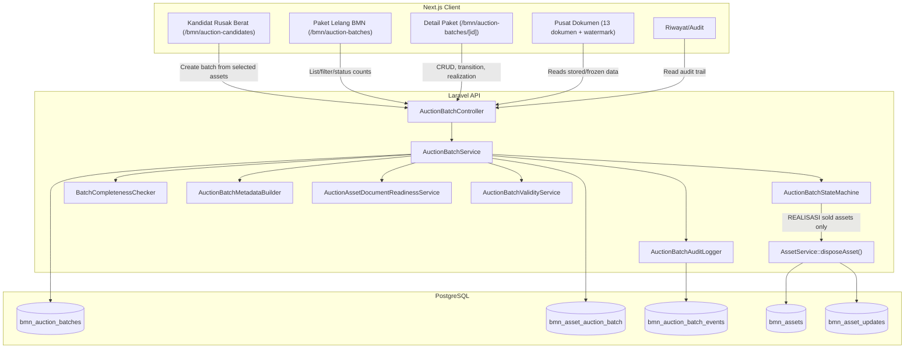
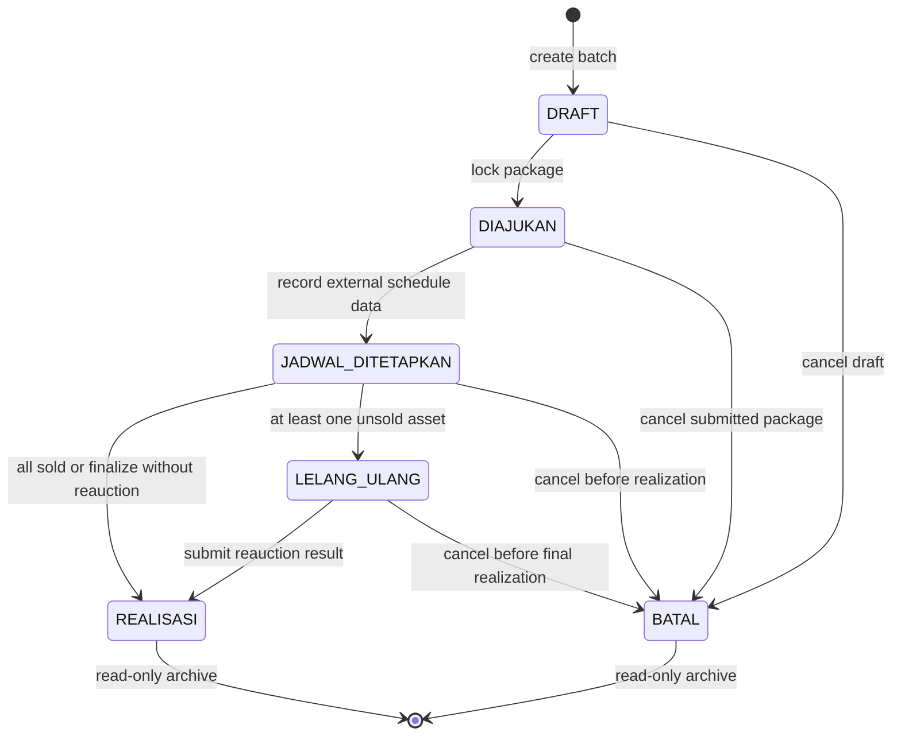

# Design Document: Paket Dokumen Lelang BMN

## Overview

Desain sistem **Paket Dokumen Lelang BMN** mendefinisikan implementasi teknis untuk menyusun, mengunci, mencetak, mencatat, dan mengarsipkan paket dokumen internal penghapusan BMN dengan tindak lanjut penjualan melalui lelang. Sistem ini tidak melakukan pengiriman, tanda tangan, disposisi, persetujuan resmi, atau pelaksanaan lelang eksternal. Semua proses resmi tersebut tetap berjalan manual di luar aplikasi oleh atasan/pejabat berwenang.

Arsitektur dibagi menjadi dua bagian utama:

1. **Laravel Backend API**: Menjadi source of truth untuk data batch, status lifecycle, validasi checklist, snapshot aset, frozen metadata, hasil lelang pertama, lelang ulang maksimal 1 kali, controlled disposal, permission, dan audit trail.
2. **Next.js Frontend Client**: Menyediakan workflow kerja bertahap untuk kandidat aset, daftar batch, detail batch bertab, pusat dokumen, pencatatan jadwal manual, realisasi, lelang ulang, dan riwayat audit.

## Design Score

Nilai target desain setelah revisi: **9.6/10**.

Alasan:
- **Clear Responsibility Boundary**: Sistem diposisikan sebagai generator dokumen dan arsip internal, bukan sistem persetujuan/lelang resmi.
- **Database Normalization**: Batch utama, junction aset, snapshot status aset, hasil lelang, dan audit event dipisahkan agar data tetap terstruktur.
- **Robust State Machine**: Enam status (`DRAFT`, `DIAJUKAN`, `JADWAL_DITETAPKAN`, `LELANG_ULANG`, `REALISASI`, `BATAL`) dikawal backend.
- **One-Time Reauction Control**: Lelang ulang hanya tersedia jika ada aset tidak terjual dan dibatasi maksimal 1 kali.
- **Historical Durability**: Frozen metadata dan asset freeze snapshot mencegah dokumen/rollback berubah akibat perubahan master data.
- **Controlled Disposal**: Soft-delete aset terjual hanya terjadi setelah realisasi final dikonfirmasi dan tervalidasi.
- **Versioned Data Contracts**: `metadata`, `asset_snapshot`, `freeze_snapshot`, readiness dokumen, dan warning administratif dibakukan sehingga renderer dan rollback tidak bergantung pada tebak-tebakan field.
- **Workflow UI**: `/bmn/auction-candidates` disederhanakan sebagai pintu pemilihan aset; pekerjaan detail dipindahkan ke `/bmn/auction-batches/[id]`.

---

## Technical Architecture



---

## Database Schema Design

Modul membutuhkan tabel utama batch, tabel junction aset, dan tabel audit event. Semua primary key menggunakan UUID agar konsisten dengan `bmn_assets`.

### 1. Tabel `bmn_auction_batches`

Menyimpan informasi utama paket dokumen lelang dan status lifecycle.

| Kolom | Tipe | Nullable | Default | Keterangan |
| --- | --- | --- | --- | --- |
| `id` | UUID | No | - | Primary key |
| `batch_number` | VARCHAR(50) | No | - | Unique, contoh `LE-20260622-9472` |
| `name` | VARCHAR(255) | No | - | Nama paket dokumen |
| `status` | VARCHAR(30) | No | `DRAFT` | `DRAFT`, `DIAJUKAN`, `JADWAL_DITETAPKAN`, `LELANG_ULANG`, `REALISASI`, `BATAL` |
| `no_surat_persetujuan` | VARCHAR(100) | Yes | NULL | Nomor surat balasan/persetujuan yang dicatat manual |
| `tanggal_surat_persetujuan` | DATE | Yes | NULL | Tanggal surat balasan/persetujuan |
| `no_surat_penetapan` | VARCHAR(100) | Yes | NULL | Nomor surat/penetapan jadwal yang dicatat manual |
| `tanggal_lelang` | DATE | Yes | NULL | Tanggal lelang pertama |
| `reauction_count` | INTEGER | No | `0` | Jumlah lelang ulang, maksimal 1 |
| `no_surat_jadwal_ulang` | VARCHAR(100) | Yes | NULL | Nomor surat/jadwal lelang ulang |
| `tanggal_lelang_ulang` | DATE | Yes | NULL | Tanggal lelang ulang |
| `reauction_notes` | TEXT | Yes | NULL | Catatan lelang ulang |
| `kepala_balai_id` | UUID | Yes | NULL | Referensi pegawai saat draft |
| `metadata` | JSONB | Yes | NULL | Frozen signatories, nomor dokumen, tanggal dokumen, print config, `schema_version`, advisory warnings |
| `realized_at` | TIMESTAMP | Yes | NULL | Waktu finalisasi realisasi |
| `canceled_at` | TIMESTAMP | Yes | NULL | Waktu pembatalan |
| `created_by` | UUID | Yes | NULL | User pembuat |
| `updated_by` | UUID | Yes | NULL | User terakhir mengubah |
| `timestamps` | TIMESTAMP | Yes | NULL | Laravel timestamps |
| `deleted_at` | TIMESTAMP | Yes | NULL | Soft delete jika diperlukan untuk arsip administratif |

Indeks:
- Unique index `batch_number`.
- Index `status`.
- Index `tanggal_lelang`.
- Index `created_by`.

### 2. Tabel `bmn_asset_auction_batch`

Junction table untuk relasi batch dan aset, sekaligus menyimpan Lot, nilai, snapshot, dan hasil lelang.

| Kolom | Tipe | Nullable | Default | Keterangan |
| --- | --- | --- | --- | --- |
| `id` | UUID | No | - | Primary key |
| `bmn_auction_batch_id` | UUID | No | - | FK ke `bmn_auction_batches.id` |
| `bmn_asset_id` | UUID | No | - | FK ke `bmn_assets.id` |
| `lot_number` | VARCHAR(50) | Yes | NULL | Nomor/nama Lot |
| `nilai_taksiran` | NUMERIC(15,2) | Yes | NULL | Nilai taksiran internal |
| `kertas_kerja_data` | JSONB | Yes | NULL | Data worksheet per aset |
| `sort_order` | INTEGER | No | 0 | Urutan lampiran |
| `asset_snapshot` | JSONB | Yes | NULL | Snapshot ringkas data aset untuk cetak historis, termasuk `document_readiness` |
| `freeze_snapshot` | JSONB | Yes | NULL | `previous_status_penggunaan`, `previous_henti_guna`, `previous_kondisi`, `previous_usul_hapus`, `previous_tanggal_pengapusan` |
| `first_auction_is_sold` | BOOLEAN | Yes | NULL | Hasil lelang pertama |
| `first_auction_price` | NUMERIC(15,2) | Yes | NULL | Harga terbentuk lelang pertama |
| `reauction_is_sold` | BOOLEAN | Yes | NULL | Hasil lelang ulang |
| `reauction_price` | NUMERIC(15,2) | Yes | NULL | Harga terbentuk lelang ulang |
| `final_result` | VARCHAR(30) | Yes | NULL | `SOLD_FIRST`, `SOLD_REAUCTION`, `UNSOLD`, `CANCELED` |
| `final_price` | NUMERIC(15,2) | Yes | NULL | Harga akhir jika terjual |
| `final_auction_date` | DATE | Yes | NULL | Tanggal lelang yang dipakai untuk penghapusan |
| `disposed_at` | TIMESTAMP | Yes | NULL | Waktu disposal internal berhasil |
| `timestamps` | TIMESTAMP | Yes | NULL | Laravel timestamps |

Indeks:
- Unique index `(bmn_auction_batch_id, bmn_asset_id)`.
- Index `bmn_asset_id`.
- Index `lot_number`.
- Index `final_result`.

### 3. Tabel `bmn_auction_batch_events`

Audit trail batch-level agar perubahan penting bisa ditelusuri.

| Kolom | Tipe | Nullable | Default | Keterangan |
| --- | --- | --- | --- | --- |
| `id` | UUID | No | - | Primary key |
| `bmn_auction_batch_id` | UUID | No | - | FK batch |
| `bmn_asset_id` | UUID | Yes | NULL | FK aset jika event terkait aset |
| `actor_id` | UUID | Yes | NULL | User pelaku |
| `action` | VARCHAR(80) | No | - | Contoh `batch.created`, `status.changed`, `asset.valuation.updated` |
| `previous_values` | JSONB | Yes | NULL | Nilai sebelum |
| `new_values` | JSONB | Yes | NULL | Nilai sesudah |
| `notes` | TEXT | Yes | NULL | Catatan tambahan |
| `created_at` | TIMESTAMP | No | now | Waktu event |

---

## Structured JSON Contracts

Semua JSON yang dipakai untuk cetak historis, rollback, dan warning harus punya `schema_version`. Versi awal modul adalah `1`.

### `bmn_auction_batches.metadata`

```json
{
  "schema_version": 1,
  "locked_at": "2026-06-22T10:30:00+08:00",
  "locked_by": "user-uuid",
  "signatories": {
    "kepala_balai": {
      "id": "employee-uuid",
      "nama": "Nama Pejabat",
      "nip": "198001012006041001",
      "golongan": "Pembina / IV-a",
      "jabatan": "Kepala Balai",
      "unit_kerja": "BKSDA",
      "source": "employees"
    }
  },
  "committees": {
    "panitia_penghapusan": [],
    "tim_penilai": [],
    "pemeriksa": []
  },
  "document_numbers": {
    "ba_koreksi": "BA.001/...",
    "sk_penghentian": "SK.001/...",
    "surat_permohonan_lelang": "S.001/..."
  },
  "document_dates": {
    "ba_koreksi": "2026-06-22",
    "sk_penghentian": "2026-06-22",
    "surat_permohonan_lelang": "2026-06-22"
  },
  "print_config": {
    "paper": "A4",
    "locale": "id-ID",
    "currency": "IDR"
  },
  "document_versions": {
    "ba_koreksi": 1,
    "ba_pemeriksaan": 1,
    "surat_permohonan_lelang": 1
  }
}
```

Rules:
- `AuctionBatchMetadataBuilder` membuat metadata saat `DRAFT -> DIAJUKAN`.
- Renderer dokumen harus membaca `metadata` frozen untuk status selain `DRAFT`.
- Jika renderer menemukan `schema_version` tidak didukung, API mengembalikan error eksplisit `unsupported_metadata_schema_version`.

### `bmn_asset_auction_batch.asset_snapshot`

```json
{
  "schema_version": 1,
  "id": "asset-uuid",
  "kode_barang": "3.02.01.01.001",
  "nup": "000001",
  "nup_lama": null,
  "nama_barang": "Kendaraan Bermotor Roda Empat",
  "merk_tipe": "Toyota Hilux",
  "kondisi": "Rusak Berat",
  "status_penggunaan": "Digunakan",
  "lokasi": "Gudang BKSDA",
  "nilai_perolehan": 250000000,
  "nilai_buku": 0,
  "vehicle_identifiers": {
    "no_polisi": "KT 0000 XX",
    "no_rangka": "MH...",
    "no_mesin": "2KD...",
    "no_bpkb": "BPKB...",
    "no_stnk": "STNK..."
  },
  "document_readiness": {
    "asset_type": "vehicle",
    "requires_document_review": true,
    "warnings": [
      "Nomor BPKB belum tersedia di master aset"
    ],
    "items": {
      "bpkb": "warning",
      "stnk": "ok",
      "no_polisi": "ok",
      "no_rangka": "ok",
      "no_mesin": "ok"
    }
  }
}
```

Rules:
- `AuctionAssetDocumentReadinessService` mendeteksi `asset_type` sebagai `vehicle` atau `general`.
- Readiness default adalah advisory. Field yang benar-benar memblokir hanya boleh berasal dari konfigurasi backend, bukan hardcode di UI.
- Candidate API dan batch detail API harus mengirim `document_readiness` agar warning konsisten di semua layar.

### `bmn_asset_auction_batch.freeze_snapshot`

```json
{
  "schema_version": 1,
  "previous_status_penggunaan": "Digunakan",
  "previous_henti_guna": false,
  "previous_kondisi": "Rusak Berat",
  "previous_usul_hapus": false,
  "previous_tanggal_pengapusan": null
}
```

Rules:
- Snapshot ini adalah satu-satunya sumber rollback saat `BATAL` atau aset tidak terjual.
- Service dilarang mengembalikan aset ke nilai hardcoded seperti `Aktif`.

### Administrative Validity Warning

`AuctionBatchValidityService` menghitung warning administratif dari tanggal surat persetujuan/manual eksternal. Nilai default window adalah 6 bulan dan harus bisa dikonfigurasi.

```json
{
  "approval_review_window_months": 6,
  "approval_review_until": "2026-12-22",
  "requires_revaluation_review": false,
  "message": null
}
```

Rules:
- Warning hanya muncul jika `tanggal_surat_persetujuan` terisi dan status belum `REALISASI`/`BATAL`.
- Jika melewati `approval_review_until`, response mengirim `requires_revaluation_review = true` dan message agar operator melakukan review ketentuan eksternal sebelum melanjutkan.
- Warning ini tidak boleh otomatis mengubah status, membatalkan batch, atau menyatakan dokumen sah/tidak sah secara hukum.

---

## State Machine & Lifecycle Rules

Transisi status dikelola oleh backend. UI hanya menampilkan aksi yang valid, tetapi backend tetap menjadi pengaman utama.



### Transition Rules

1. **DRAFT -> DIAJUKAN**
   - Minimal 1 aset.
   - Semua aset memiliki `lot_number`.
   - Semua aset memiliki `nilai_taksiran > 0`.
   - Kepala Balai, Panitia, Tim Penilai/Penaksir, Pemeriksa, nomor dokumen, dan tanggal dokumen wajib lengkap.
   - Backend menyimpan `metadata`, `asset_snapshot`, dan `freeze_snapshot`.
   - Backend membekukan aset dengan `henti_guna = true` dan `status_penggunaan = 'Dihentikan dari Penggunaan Dinas'`.

2. **DIAJUKAN -> JADWAL_DITETAPKAN**
   - Wajib input `no_surat_persetujuan`, `tanggal_surat_persetujuan`, `no_surat_penetapan`, dan `tanggal_lelang`.
   - Label UI harus menyatakan data ini dicatat manual dari proses eksternal.

3. **JADWAL_DITETAPKAN -> REALISASI**
   - Semua aset harus memiliki hasil lelang pertama.
   - Jika semua terjual, finalisasi langsung memakai `tanggal_lelang`.
   - Jika ada yang tidak terjual, admin boleh tetap finalisasi tanpa lelang ulang; aset tidak terjual dikembalikan ke snapshot awal.

4. **JADWAL_DITETAPKAN -> LELANG_ULANG**
   - Minimal 1 aset tidak terjual pada lelang pertama.
   - `reauction_count` harus 0.
   - Wajib input `no_surat_jadwal_ulang` dan `tanggal_lelang_ulang`.
   - Hanya aset tidak terjual pada lelang pertama yang muncul di form hasil lelang ulang.

5. **LELANG_ULANG -> REALISASI**
   - Semua aset peserta lelang ulang harus memiliki hasil.
   - Aset terjual saat lelang ulang memakai `tanggal_lelang_ulang`.
   - Aset tetap tidak terjual dikembalikan ke snapshot awal dan tidak di-soft-delete.

6. **Any non-final status -> BATAL**
   - `DRAFT`: release association tanpa mengubah aset jika belum ada snapshot freeze.
   - `DIAJUKAN`, `JADWAL_DITETAPKAN`, `LELANG_ULANG`: restore aset dari `freeze_snapshot`.
   - Batch menjadi read-only archive.

7. **REALISASI and BATAL**
   - Semua operasi tulis ditolak, kecuali audit/archival read.

---

## API Endpoints Design

Semua endpoint memakai Sanctum dan permission granular. Response create menggunakan HTTP `201 Created`.

### 1. Candidate and Batch List

* `GET /api/bmn/auction-candidates`
  * Deskripsi: Mendapatkan aset `Rusak Berat` yang eligible untuk batch baru.
  * Query: `search`, `page`, `per_page`, filter aset.
  * Response harus memberi indikator `active_auction_batch_id` jika aset sudah terkunci batch aktif.
  * Response asset harus menyertakan `document_readiness`, `requires_document_review`, dan `document_readiness_warnings` dari `AuctionAssetDocumentReadinessService`.
  * Permission: `bmn.auction.view`.

* `GET /api/bmn/auction-batches`
  * Deskripsi: List paket lelang.
  * Query: `search`, `status`, `page`, `per_page`.
  * Response list menyertakan `metadata_schema_version`, `is_read_only`, dan ringkasan `validity_warning` jika relevan.
  * Permission: `bmn.auction.view`.

* `POST /api/bmn/auction-batches`
  * Payload: `{ "name": "...", "asset_ids": ["uuid"] }`.
  * Membuat batch `DRAFT`; opsional langsung melampirkan aset terpilih dari candidate page.
  * Permission: `bmn.auction.create`.

* `GET /api/bmn/auction-batches/{id}`
  * Deskripsi: Detail batch, aset, pivot, metadata, checklist, permissions, dan status read-only.
  * Response utama wajib menyertakan:
    - `metadata_schema_version`,
    - `validity_warning`,
    - `is_read_only`,
    - `available_transitions`,
    - `assets[].document_readiness`,
    - `assets[].requires_document_review`,
    - `assets[].document_readiness_warnings`.
  * Permission: `bmn.auction.view`.

### 2. Draft Asset, Lot, and Valuation

* `POST /api/bmn/auction-batches/{id}/assets`
  * Payload: `{ "asset_ids": ["uuid-1", "uuid-2"] }`.
  * Hanya `DRAFT`.
  * Permission: `bmn.auction.update`.

* `DELETE /api/bmn/auction-batches/{id}/assets/{assetId}`
  * Hanya `DRAFT`.
  * Permission: `bmn.auction.update`.

* `PUT /api/bmn/auction-batches/{id}/assets/order`
  * Payload: `{ "ordered_ids": ["uuid-1", "uuid-2"] }`.
  * Hanya `DRAFT`.
  * Permission: `bmn.auction.update`.

* `PUT /api/bmn/auction-batches/{id}/assets/{assetId}/valuation`
  * Payload: `{ "lot_number": "Lot 1", "nilai_taksiran": 1500000, "kertas_kerja_data": { ... } }`.
  * Hanya `DRAFT`.
  * Permission: `bmn.auction.update`.

### 3. Checklist, Metadata, and Status Transition

* `GET /api/bmn/auction-batches/{id}/checklist`
  * Mengembalikan checklist kelengkapan dan reason jika tombol lock belum aktif.
  * Checklist wajib menyertakan readiness warning per aset dan membedakan `blocking` dari `warning`.
  * Permission: `bmn.auction.view`.

* `POST /api/bmn/auction-batches/{id}/transition`
  * Payload untuk `DIAJUKAN`:
    ```json
    {
      "status": "DIAJUKAN",
      "kepala_balai_id": "uuid",
      "signatories": {
        "panitia": [],
        "tim_penilai": [],
        "pemeriksa": []
      },
      "document_numbers": {},
      "document_dates": {}
    }
    ```
  * Payload untuk `JADWAL_DITETAPKAN`:
    ```json
    {
      "status": "JADWAL_DITETAPKAN",
      "no_surat_persetujuan": "...",
      "tanggal_surat_persetujuan": "2026-06-20",
      "no_surat_penetapan": "...",
      "tanggal_lelang": "2026-07-10"
    }
    ```
  * Payload untuk `LELANG_ULANG`:
    ```json
    {
      "status": "LELANG_ULANG",
      "no_surat_jadwal_ulang": "...",
      "tanggal_lelang_ulang": "2026-07-20",
      "reauction_notes": "Aset Lot 2 tidak terjual pada lelang pertama."
    }
    ```
  * Payload untuk `BATAL`: `{ "status": "BATAL", "notes": "..." }`.
  * Permission: `bmn.auction.update` untuk `DIAJUKAN`; `bmn.auction.finalize` untuk status setelahnya.

### 4. Auction Results and Final Realization

* `POST /api/bmn/auction-batches/{id}/first-auction-results`
  * Hanya status `JADWAL_DITETAPKAN`.
  * Payload:
    ```json
    {
      "assets": [
        { "bmn_asset_id": "uuid-1", "first_auction_is_sold": true, "first_auction_price": 1600000 },
        { "bmn_asset_id": "uuid-2", "first_auction_is_sold": false, "first_auction_price": null }
      ]
    }
    ```
  * Permission: `bmn.auction.finalize`.

* `POST /api/bmn/auction-batches/{id}/reauction-results`
  * Hanya status `LELANG_ULANG`.
  * Hanya menerima aset yang tidak terjual pada lelang pertama.
  * Permission: `bmn.auction.finalize`.

* `POST /api/bmn/auction-batches/{id}/realize`
  * Final confirmation untuk status `REALISASI`.
  * Backend menghitung `final_result`, `final_price`, `final_auction_date`, lalu memproses disposal hanya untuk aset terjual.
  * Permission: `bmn.auction.finalize`.

### 5. Documents and Audit

* `GET /api/bmn/auction-batches/{id}/documents/context`
  * Mengembalikan data cetak terstruktur, frozen metadata, watermark mode, dan read-only state.
  * Permission: `bmn.auction.print`.

* `POST /api/bmn/auction-batches/{id}/documents/{documentKey}/print-event`
  * Mencatat event cetak/generate.
  * Permission: `bmn.auction.print`.

* `GET /api/bmn/auction-batches/{id}/events`
  * Audit trail paginated.
  * Permission: `bmn.auction.view`.

---

## Frontend Component & UI Design

UI harus terasa seperti workspace operasional BMN: padat, terstruktur, berbasis status, dan menonjolkan aksi berikutnya. Hindari landing-page composition dan dekorasi berlebihan.

### 1. Kandidat Rusak Berat (`/bmn/auction-candidates`)

Tujuan halaman: memilih aset eligible dan membuat batch.

- Header ringkas dengan count total kandidat, count dipilih, dan nilai perolehan dipilih.
- Search/filter aset rusak berat.
- Tabel aset dengan indikator:
  - eligible,
  - sudah berada di batch aktif,
  - data kendaraan/dokumen penting belum lengkap.
- Aksi utama tunggal: **Buat Paket Lelang**.
- Setelah batch dibuat, redirect ke `/bmn/auction-batches/[id]`.
- Tidak menampilkan 13 tombol dokumen di halaman ini.

### 2. Daftar Paket Lelang (`/bmn/auction-batches`)

- Search nama/nomor batch.
- Filter status: `DRAFT`, `DIAJUKAN`, `JADWAL_DITETAPKAN`, `LELANG_ULANG`, `REALISASI`, `BATAL`.
- Status badge dengan warna semantik:
  - `DRAFT`: neutral,
  - `DIAJUKAN`: blue,
  - `JADWAL_DITETAPKAN`: amber,
  - `LELANG_ULANG`: orange,
  - `REALISASI`: green,
  - `BATAL`: red/gray.
- Kolom/card: nama batch, nomor batch, jumlah aset, nilai taksiran total, status, tanggal lelang, progress checklist.
- Empty state dengan aksi membuat batch dari kandidat.

### 3. Detail Paket (`/bmn/auction-batches/[id]`)

Layout:
- Sticky header: nama batch, nomor batch, status, jumlah aset, nilai taksiran total, aksi status berikutnya.
- Status timeline horizontal dengan enam status.
- Tabs:
  1. **Aset & Lot**
  2. **Nilai Taksiran / Kertas Kerja**
  3. **Penandatangan & Nomor Dokumen**
  4. **Pusat Dokumen**
  5. **Jadwal Lelang**
  6. **Realisasi & Lelang Ulang**
  7. **Riwayat/Audit**

Tab behavior:
- `DRAFT`: tabs 1-4 editable sesuai permission; tab jadwal/realisasi locked.
- `DIAJUKAN`: tabs 1-4 read-only/frozen; tab jadwal editable untuk admin.
- `JADWAL_DITETAPKAN`: tab realisasi lelang pertama editable untuk admin.
- `LELANG_ULANG`: hanya form hasil lelang ulang untuk aset tidak terjual yang editable.
- `REALISASI`/`BATAL`: semua tabs read-only.

### 4. Pusat Dokumen

- Grid dokumen dikelompokkan:
  - Berita Acara,
  - Surat Keputusan,
  - Surat Pernyataan/Pendukung,
  - Surat/Nota Pengantar.
- Setiap dokumen menampilkan:
  - status kelengkapan nomor/tanggal,
  - sumber data (`DRAFT` atau frozen metadata),
  - tombol preview,
  - tombol cetak/save PDF.
- Watermark:
  - `DRAFT`: `DRAFT - BELUM UNTUK DIKIRIM`.
  - `BATAL`: `BATAL - ARSIP`.
  - status lain: bersih dan memakai frozen metadata.

### 5. Realisasi & Lelang Ulang

- Pada `JADWAL_DITETAPKAN`, tampilkan tabel semua aset:
  - Lot,
  - Nama Barang/NUP,
  - Nilai Taksiran,
  - Terjual/Tidak Terjual,
  - Harga Terbentuk.
- Jika ada aset tidak terjual:
  - CTA **Mulai Lelang Ulang** jika `reauction_count = 0`.
  - CTA **Finalisasi Tanpa Lelang Ulang** untuk mengembalikan aset tidak terjual ke snapshot awal.
- Pada `LELANG_ULANG`, tampilkan hanya aset yang tidak terjual di lelang pertama.
- Finalisasi menampilkan dialog konfirmasi berisi konsekuensi:
  - aset terjual akan diisi `tanggal_pengapusan` dan diproses disposal,
  - aset tidak terjual akan dikembalikan ke snapshot awal,
  - batch menjadi read-only.

---

## Security & Access Control Matrix

| Aksi Sistem | Peran Minimum | Permission | Validasi Server |
| --- | --- | --- | --- |
| Melihat kandidat/batch | Operator, Admin BMN, Pimpinan | `bmn.auction.view` | Auth + permission |
| Membuat batch | Operator, Admin BMN | `bmn.auction.create` | Eligible assets only |
| Menambah/menghapus aset | Operator, Admin BMN | `bmn.auction.update` | Status harus `DRAFT` |
| Mengubah Lot/urutan/nilai | Operator, Admin BMN | `bmn.auction.update` | Status harus `DRAFT` |
| Mengunci ke `DIAJUKAN` | Operator, Admin BMN | `bmn.auction.update` | Checklist lengkap |
| Cetak/generate dokumen | Operator, Admin BMN | `bmn.auction.print` | Batch readable, event logged |
| Input jadwal eksternal | Admin BMN | `bmn.auction.finalize` | Status harus `DIAJUKAN` |
| Input hasil lelang pertama | Admin BMN | `bmn.auction.finalize` | Status harus `JADWAL_DITETAPKAN` |
| Mulai lelang ulang | Admin BMN | `bmn.auction.finalize` | Ada aset tidak terjual, `reauction_count = 0` |
| Finalisasi realisasi | Admin BMN | `bmn.auction.finalize` | Semua hasil final lengkap |
| Membatalkan batch | Admin BMN | `bmn.auction.finalize` | Status belum final |
| Melihat audit | Operator, Admin BMN, Pimpinan | `bmn.auction.view` | Read-only |

Backend tetap menolak request tidak sah walaupun kontrol frontend dibypass.

---

## Performance & Optimization Design

1. **Paginated Candidates**: Candidate page harus selalu paginated dan filter server-side.
2. **Avoid N+1 Queries**: Detail batch memakai eager loading aset, pivot, creator/updater, dan count event seperlunya.
3. **JSONB for Metadata and Snapshots**: `metadata`, `asset_snapshot`, `freeze_snapshot`, `kertas_kerja_data`, dan audit values memakai JSONB agar fleksibel dan queryable.
4. **Transactional Writes**: Transisi status, freeze aset, rollback, lelang ulang, realisasi, dan disposal harus berada dalam `DB::transaction()`.
5. **Idempotency Guard**: Finalisasi realisasi harus menolak pemanggilan ulang jika batch sudah `REALISASI` atau pivot sudah memiliki `disposed_at`.
6. **Print CSS Isolation**: Layout cetak memakai CSS terisolasi dari dashboard agar margin, font, page-break, dan watermark stabil.
7. **Audit Event Batching**: Untuk perubahan massal aset, audit bisa ditulis batch insert agar tidak memperlambat transisi.

---

## Error Handling & Validation Design

- Semua invalid transition mengembalikan HTTP 422 dengan `message` dan `errors`.
- Checklist lock mengembalikan daftar item gagal agar UI bisa menampilkan recovery path.
- Double-batching aset mengembalikan detail batch aktif yang mengunci aset.
- Reauction kedua mengembalikan error eksplisit: `Lelang ulang hanya dapat dilakukan 1 kali.`
- Realisasi tanpa hasil lengkap ditolak dengan daftar aset yang belum memiliki keputusan.
- Disposal failure membatalkan transaction agar tidak ada batch `REALISASI` parsial.

---

## Audit Event Action Names

Action names yang direkomendasikan:

- `batch.created`
- `batch.updated`
- `batch.canceled`
- `status.changed`
- `asset.added`
- `asset.removed`
- `asset.order.updated`
- `asset.valuation.updated`
- `batch.locked`
- `asset.freeze_snapshot.created`
- `schedule.recorded`
- `document.printed`
- `first_auction.result.recorded`
- `reauction.started`
- `reauction.result.recorded`
- `realization.finalized`
- `asset.disposed`
- `asset.restored`
