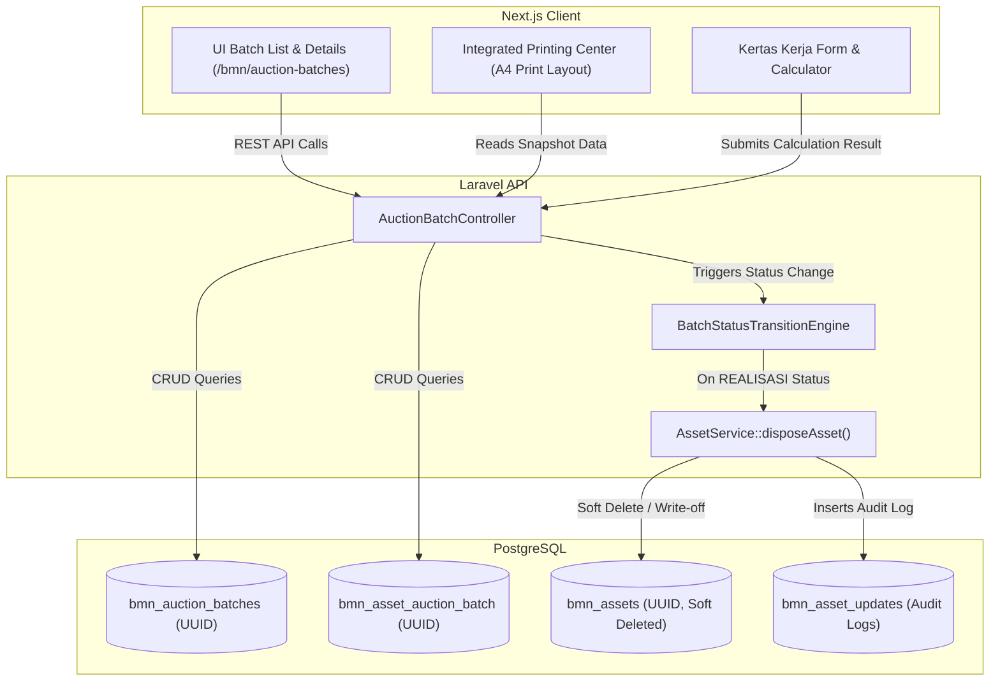
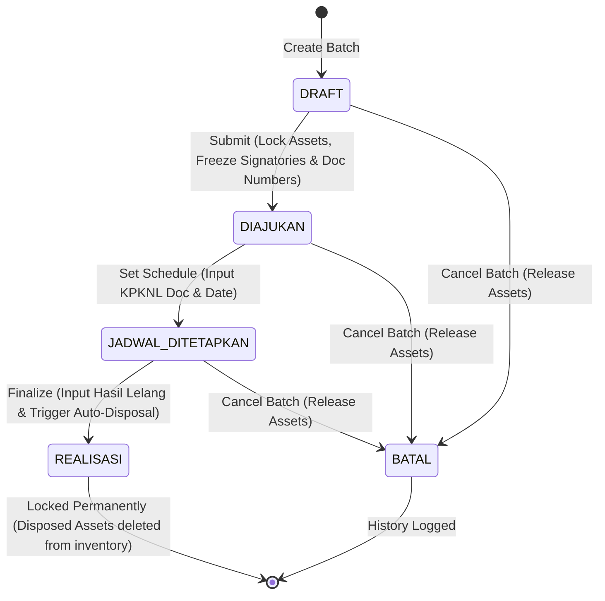

# Design Document: BMN Auction Batches (Proses Lelang BMN)

## Overview

Desain sistem **BMN Auction Batches** mendefinisikan implementasi teknis untuk mendigitalkan siklus hidup proses lelang BMN di lingkungan Balai Konservasi Sumber Daya Alam (BKSDA). Arsitektur sistem ini dibagi menjadi dua bagian utama:
1. **Laravel Backend API**: Bertanggung jawab atas pengelolaan skema database, aturan bisnis validasi status, logging perubahan data, integrasi transaksional untuk penghapusan otomatis (*auto-disposal*), dan penyediaan RESTful API untuk frontend.
2. **Next.js Frontend Client**: Menyediakan antarmuka dinamis dan responsif (Vite/Next.js sesuai teknologi monorepo) untuk penyusunan batch, pengelompokan Lot, pengisian Kertas Kerja, pengaturan penandatangan, penginputan hasil lelang riil, serta *Integrated Printing Center* untuk 13 dokumen legal.

## Design Score

Nilai target desain setelah audit: **9.8/10**.

Alasan:
- **Database Normalization**: Struktur junction table `bmn_asset_auction_batch` memisahkan data transaksional lelang dari data inventaris utama `bmn_assets`.
- **Signatory Durability (Frozen Data)**: Penggunaan tipe data JSON pada kolom `metadata` batch memastikan integritas cetak berkas legal di masa depan bersifat *immutable* terhadap rotasi jabatan pegawai.
- **Robust State Machine**: Logika transisi status dikawal ketat oleh API backend, menolak modifikasi data pada status terkunci (`DIAJUKAN`, `REALISASI`, `BATAL`).
- **Atomic Auto-Disposal**: Proses *write-off* aset terjual berjalan di dalam satu database transaction Laravel untuk menjamin konsistensi data (*all-or-nothing*).

---

## Technical Architecture



---

## Database Schema Design

Modul lelang membutuhkan 2 tabel baru di database PostgreSQL. Kolom primary key menggunakan UUID (`HasUuids` pada model Eloquent) untuk konsistensi dengan tabel `bmn_assets`.

### 1. Tabel `bmn_auction_batches`
Menyimpan informasi utama batch lelang.

| Nama Kolom | Tipe Data | Nullable | Default | Keterangan / Foreign Key |
| --- | --- | --- | --- | --- |
| `id` | `UUID` | No | - | Primary Key |
| `batch_number` | `VARCHAR(50)` | No | - | Unique, kode identifikasi batch (misal: `LE-20260622-9472`) |
| `name` | `VARCHAR(255)` | No | - | Nama deskriptif batch (misal: `"Lelang BMN Kendaraan Dinas 2026"`) |
| `status` | `VARCHAR(30)` | No | `'DRAFT'` | Enum: `DRAFT`, `DIAJUKAN`, `JADWAL_DITETAPKAN`, `REALISASI`, `BATAL` |
| `no_surat_penetapan`| `VARCHAR(100)`| Yes | `NULL` | Nomor surat jadwal lelang dari KPKNL |
| `tanggal_lelang` | `DATE` | Yes | `NULL` | Tanggal pelaksanaan lelang |
| `kepala_balai_id` | `UUID` | Yes | `NULL` | FK ke tabel `employees.id` (pilihan Kepala Balai saat draf) |
| `metadata` | `JSONB` | Yes | `NULL` | Frozen signatories data (nama, NIP) & nomor-nomor dokumen |
| `created_at` | `TIMESTAMP` | Yes | `NULL` | Timestamp dibuat |
| `updated_at` | `TIMESTAMP` | Yes | `NULL` | Timestamp diubah |
| `deleted_at` | `TIMESTAMP` | Yes | `NULL` | Soft deletes |

*Indeks*:
- Index unik pada `batch_number`.
- Index B-Tree pada `status`.

### 2. Tabel `bmn_asset_auction_batch`
Junction table untuk relasi many-to-many antara batch lelang dan aset BMN.

| Nama Kolom | Tipe Data | Nullable | Default | Keterangan / Foreign Key |
| --- | --- | --- | --- | --- |
| `id` | `UUID` | No | - | Primary Key |
| `bmn_auction_batch_id`| `UUID`| No | - | FK ke `bmn_auction_batches.id` (ON DELETE CASCADE) |
| `bmn_asset_id` | `UUID` | No | - | FK ke `bmn_assets.id` (ON DELETE RESTRICT) |
| `lot_number` | `VARCHAR(50)` | Yes | `NULL` | Pengelompokan lot lelang |
| `nilai_taksiran` | `NUMERIC(15,2)`| Yes | `NULL` | Limit lelang (harga minimum pembukaan lelang) |
| `harga_terbentuk` | `NUMERIC(15,2)`| Yes | `NULL` | Realisasi harga lelang terjual |
| `is_sold` | `BOOLEAN` | Yes | `NULL` | Status hasil lelang (True = Terjual, False = Tidak Terjual) |
| `kertas_kerja_data` | `JSONB` | Yes | `NULL` | Hasil input formulir Kertas Kerja Analisis Taksiran |
| `sort_order` | `INTEGER` | No | `0` | Mengatur urutan visual drag-and-drop |
| `created_at` | `TIMESTAMP` | Yes | `NULL` | Timestamp dibuat |
| `updated_at` | `TIMESTAMP` | Yes | `NULL` | Timestamp diubah |

*Indeks*:
- Index unik gabungan `(bmn_auction_batch_id, bmn_asset_id)`.
- Index B-Tree pada `lot_number`.

---

## State Machine & Lifecycle Transition Rules

Logika transisi status dikelola secara tersentralisasi di backend. Transisi yang tidak valid akan menghasilkan HTTP 422 (Unprocessable Entity).



### Aturan Transisi & Validasi Backend:
1. **DRAFT → DIAJUKAN**:
   - Harus terdapat minimal 1 aset terasosiasi.
   - Semua aset wajib memiliki `nilai_taksiran` > 0.
   - Semua aset wajib memiliki `lot_number` (tidak boleh kosong).
   - Pengguna harus sudah memilih Kepala Balai dan memasukkan nomor-nomor dokumen awal.
   - Backend melakukan query detail pegawai aktif (Kepala Balai, Panitia, Tim Penilai, Pemeriksa) dan membekukan informasi tersebut ke kolom `metadata`.
2. **DIAJUKAN → JADWAL_DITETAPKAN**:
   - Memerlukan input `no_surat_penetapan` (KPKNL) dan `tanggal_lelang`.
   - Tanggal lelang tidak boleh di masa lampau (harus `>= hari_ini`).
3. **JADWAL_DITETAPKAN → REALISASI**:
   - Memerlukan input `is_sold` (true/false) untuk seluruh aset di dalam batch.
   - Jika `is_sold = true`, maka `harga_terbentuk` wajib diisi dan harus `>= 0`.
   - Memicu mekanisme **Auto-Disposal** secara atomik (DB Transaction).
4. **BATAL (dari DRAFT, DIAJUKAN, atau JADWAL_DITETAPKAN)**:
   - Status keterikatan aset dilepas (relasi di junction table tetap dipertahankan untuk histori, tetapi aset tersebut tidak lagi berstatus terikat lelang aktif sehingga dapat diajukan di batch lain).

---

## API Endpoints Design

Semua endpoints terproteksi middleware authentication (Sanctum) dan permission checks.

### 1. CRUD Batch Utama
*   `GET /api/bmn/auction-batches`
    *   **Deskripsi**: Mendapatkan daftar batch lelang (paginated).
    *   **Query Params**: `search=...`, `status=DRAFT|DIAJUKAN|...`, `page=1`, `per_page=15`
    *   **Permission**: `bmn.auction.view`
*   `POST /api/bmn/auction-batches`
    *   **Deskripsi**: Membuat batch lelang baru.
    *   **Payload**: `{ "name": "Lelang AC Balai 2026" }`
    *   **Permission**: `bmn.auction.create`
*   `GET /api/bmn/auction-batches/{id}`
    *   **Deskripsi**: Mengambil rincian detail batch lelang beserta list aset, lot, dan metadata penandatangan.
    *   **Permission**: `bmn.auction.view`
*   `DELETE /api/bmn/auction-batches/{id}`
    *   **Deskripsi**: Menghapus batch lelang (hanya diperbolehkan jika status `DRAFT`).
    *   **Permission**: `bmn.auction.delete`

### 2. Manajemen Aset & Lot di Batch
*   `POST /api/bmn/auction-batches/{id}/assets`
    *   **Deskripsi**: Menambahkan aset rusak berat ke dalam batch.
    *   **Payload**: `{ "asset_ids": ["uuid-1", "uuid-2"] }`
    *   **Permission**: `bmn.auction.update`
*   `DELETE /api/bmn/auction-batches/{id}/assets/{assetId}`
    *   **Deskripsi**: Mengeluarkan aset dari batch (hanya diperbolehkan jika status `DRAFT`).
    *   **Permission**: `bmn.auction.update`
*   `PUT /api/bmn/auction-batches/{id}/assets/order`
    *   **Deskripsi**: Memperbarui urutan visual aset dalam batch.
    *   **Payload**: `{ "ordered_ids": ["uuid-1", "uuid-2", "uuid-3"] }`
    *   **Permission**: `bmn.auction.update`
*   `PUT /api/bmn/auction-batches/{id}/assets/{assetId}/valuation`
    *   **Deskripsi**: Mengupdate data lot, nilai taksiran, atau data kertas kerja individu aset.
    *   **Payload**:
        ```json
        {
          "lot_number": "Lot 1",
          "nilai_taksiran": 1500000.00,
          "kertas_kerja_data": {
            "nilai_perolehan": 5000000,
            "faktor_penyusutan": 70,
            "kondisi_persen": 30,
            "keterangan": "Rusak berat kompresor mati"
          }
        }
        ```
    *   **Permission**: `bmn.auction.update`

### 3. Kontrol Transisi Status & Realisasi
*   `POST /api/bmn/auction-batches/{id}/transition`
    *   **Deskripsi**: Memicu perubahan status batch lelang.
    *   **Payload**:
        ```json
        {
          "status": "DIAJUKAN",
          "kepala_balai_id": "uuid-pegawai-aktif",
          "document_numbers": {
            "ba_koreksi": "BA.12/KOR/2026",
            "sk_penghentian": "SK.45/HENTI/2026",
            "sk_panitia": "SK.46/PAN/2026",
            "sk_tim_penilai": "SK.47/TIM/2026"
          }
        }
        ```
    *   **Permission**: `bmn.auction.update` (untuk DIAJUKAN), `bmn.auction.finalize` (untuk JADWAL_DITETAPKAN & REALISASI)
*   `POST /api/bmn/auction-batches/{id}/realize`
    *   **Deskripsi**: Menyelesaikan lelang (status `REALISASI`), menginput data terjual, dan memicu penghapusan otomatis.
    *   **Payload**:
        ```json
        {
          "assets": [
            { "bmn_asset_id": "uuid-1", "is_sold": true, "harga_terbentuk": 1600000 },
            { "bmn_asset_id": "uuid-2", "is_sold": false, "harga_terbentuk": 0 }
          ]
        }
        ```
    *   **Permission**: `bmn.auction.finalize`

---

## Frontend Component & UI Design

Struktur antarmuka baru dikelompokkan di bawah rute `/bmn/auction-batches` menggunakan Next.js (atau React Router di monorepo).

### 1. Batch List Screen (`/bmn/auction-batches/page.tsx`)
Menampilkan tabel/list batch lelang yang ada di database.
- **Search Bar**: Mencari nama batch atau nomor batch.
- **Filter Status**: Dropdown pilihan status (`DRAFT`, `DIAJUKAN`, `JADWAL_DITETAPKAN`, `REALISASI`, `BATAL`).
- **Button "Buat Batch Baru"**: Membuka modal input nama batch.
- **Batch Cards**: Menampilkan Nama Batch, Nomor Batch, Jumlah Aset, Tanggal Lelang (jika ada), dan Status Badge berwarna:
  - `DRAFT`: Abu-abu (`bg-zinc-100 text-zinc-800`)
  - `DIAJUKAN`: Biru (`bg-blue-100 text-blue-800`)
  - `JADWAL_DITETAPKAN`: Amber (`bg-amber-100 text-amber-800`)
  - `REALISASI`: Hijau (`bg-emerald-100 text-emerald-800`)
  - `BATAL`: Merah (`bg-rose-100 text-rose-800`)

### 2. Batch Detail Screen (`/bmn/auction-batches/[id]/page.tsx`)
Antarmuka sentral yang dibagi menjadi sub-tab untuk menjaga kerapian tata letak:
- **Tab 1: Manajemen Aset & Lot**
  - Hanya aktif jika status `DRAFT`.
  - Sisi Kiri: Panel Pencari Kandidat Aset (hanya menampilkan aset `Rusak Berat` yang aktif).
  - Sisi Kanan: Panel Aset Terpilih di dalam batch dengan fitur drag-and-drop reordering, kolom input cepat `Lot Number`, kolom `Nilai Taksiran` (bisa diubah manual), dan button untuk membuka modal Kertas Kerja.
- **Tab 2: Kertas Kerja (Worksheet)**
  - Tampilan tabular untuk seluruh aset terpilih. Pengguna bisa mengedit kalkulator kertas kerja satu per satu di panel detail.
- **Tab 3: Penandatangan & Dokumen**
  - Dropdown Kepala Balai, editor Panitia, Pemeriksa, Tim Penilai.
  - Input teks untuk nomor dokumen lelang (BA Koreksi, SK Penghentian, dll.).
  - Tombol **"Kunci & Ajukan Batch"** (mengubah status ke `DIAJUKAN`).
- **Tab 4: integrated Printing Center**
  - Menampilkan grid ke-13 dokumen legal. Pengguna tinggal menekan tombol "Cetak" untuk membuka dialog print A4 browser. Layout CSS menggunakan `@media print` terisolasi agar hasil cetak tidak melenceng.
- **Tab 5: Pencatatan Hasil Lelang**
  - Terbuka ketika status berada pada `JADWAL_DITETAPKAN`.
  - Berisi tabel aset di batch dengan opsi checklist "Terjual" dan input angka "Harga Terbentuk".
  - Tombol **"Selesaikan Realisasi Lelang BMN"** dengan konfirmasi dialog ganda.

---

## Security & Access Control Matrix

Keamanan data dipastikan di sisi client (sembunyikan elemen) dan dipaksa (*enforced*) secara ketat di sisi server.

| Aksi Sistem | Peran Minimum | Gate Permission | Validasi Server |
| --- | --- | --- | --- |
| Melihat Daftar Batch | Operator, Admin BMN, Pimpinan | `bmn.auction.view` | Memeriksa token & permission |
| Membuat Batch Baru | Operator, Admin BMN | `bmn.auction.create` | Memeriksa token & permission |
| Mengubah Urutan Aset/Lot/KK | Operator, Admin BMN | `bmn.auction.update` | Validasi status batch harus `DRAFT` |
| Menghapus Batch | Operator, Admin BMN | `bmn.auction.delete` | Validasi status batch harus `DRAFT` |
| Mengunci Batch (`DIAJUKAN`) | Operator, Admin BMN | `bmn.auction.update` | Validasi kelengkapan Nilai Taksiran & Lot |
| Memasukkan Jadwal KPKNL | Admin BMN | `bmn.auction.finalize` | Validasi status batch saat ini harus `DIAJUKAN` |
| Menyelesaikan Realisasi | Admin BMN | `bmn.auction.finalize` | Mengunci data permanen, memicu `soft-delete` |
| Membatalkan Batch | Admin BMN | `bmn.auction.finalize` | Melepas relasi aset aktif |

---

## Performance & Optimization Design

1. **JSONB Query Indexing**: Field `metadata` dan `kertas_kerja_data` menggunakan tipe data `JSONB` pada PostgreSQL (bukan JSON text biasa) untuk mendukung efisiensi query tingkat lanjut di masa depan (menggunakan operator `@>`).
2. **Paginated Candidate Selection**: Pencarian aset kandidat rusak berat mematuhi prinsip tidak me-load seluruh data sekaligus. Filter dikirim ke Laravel via Query Params.
3. **Database Transaction Safeguard**:
   ```php
   // Pseudo-code implementation di backend untuk Realisasi
   DB::transaction(function () use ($batch, $results) {
       $batch->update(['status' => 'REALISASI']);
       foreach ($results as $item) {
           $junction = $batch->assets()->where('bmn_asset_id', $item['id'])->first();
           $junction->update([
               'is_sold' => $item['is_sold'],
               'harga_terbentuk' => $item['harga_terbentuk']
           ]);
           
           if ($item['is_sold']) {
               // Memanggil disposeAsset dari AssetService
               $this->assetService->disposeAsset($item['id'], auth()->id(), "Lelang Terjual Batch: " . $batch->batch_number);
           }
       }
   });
   ```
4. **CSS Print Isolation**: Menghindari penggunaan framework CSS global pada layout cetak dokumen lelang untuk menjamin presisi margin, page-break, dan rendering font di berbagai browser.
