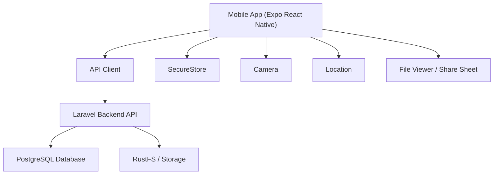
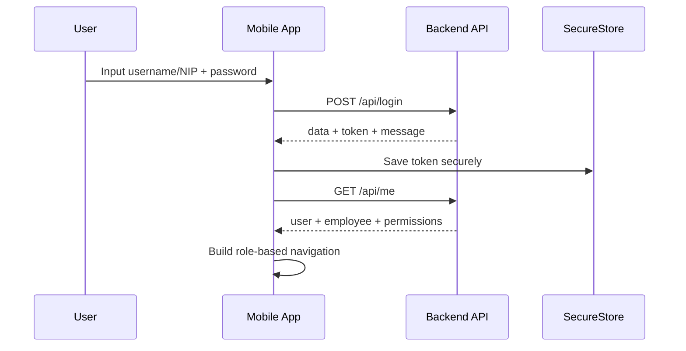

# Design Document

## Overview

Mobile App BKSDA SuperApp dirancang sebagai klien mobile untuk backend Laravel yang sama dengan web. App ini mengutamakan pekerjaan operasional yang masuk akal dilakukan dari perangkat mobile: melihat dashboard, mengelola BMN sesuai role, mengambil foto/geotag aset, memproses peminjaman/pengembalian, serta mengelola Surat Tugas sesuai permission.

Target pertama adalah Android. Struktur teknis dan UI tetap disiapkan agar iOS dapat menyusul tanpa desain ulang besar.

## Design Score

Nilai desain target setelah audit: **9.5/10**.

Alasan:

- Scope mobile jelas dan tidak memindahkan seluruh desktop mentah ke layar kecil.
- Semua fitur dikendalikan permission backend.
- Online-only MVP mengurangi kompleksitas sync/offline.
- API readiness sudah disiapkan sebelum mobile coding.
- Navigasi, list, form, dan upload foto dirancang mengikuti standar mobile.
- Permission matrix, non-functional targets, release milestones, dan measurable quality gates sudah ditambahkan agar desain bisa dieksekusi dan diuji.

Sisa risiko yang diterima:

- Nama permission final tetap harus diverifikasi langsung dari backend saat implementation spike.
- Beberapa endpoint existing masih perlu diuji dari mobile runtime.
- iOS masih fase berikutnya, sehingga validasi awal akan fokus Android.

## Technology Recommendation

### Mobile Framework

Gunakan **Expo React Native + TypeScript** untuk MVP.

Alasan:

- Cepat untuk Android build awal.
- Siap iOS tanpa rewrite.
- Ekosistem matang untuk camera, location, secure storage, file download, dan PDF/share.
- Cocok dengan API backend yang sudah ada.

Library utama yang disarankan:

- Navigation: React Navigation.
- Server state: TanStack Query.
- Secure token storage: Expo SecureStore.
- Camera: Expo Camera.
- Location: Expo Location.
- File/download/share: Expo FileSystem, Expo Sharing, IntentLauncher untuk Android jika perlu.
- Forms: React Hook Form + Zod.
- Lists: FlatList/FlashList untuk data panjang.
- UI base: NativeWind atau React Native StyleSheet dengan design tokens internal.

## Architecture



### App Layers

1. **App Shell**
   - Root navigation.
   - Auth bootstrap.
   - Global error boundary.
   - Theme provider.

2. **Auth Layer**
   - Login.
   - Token storage.
   - Session restore.
   - Logout.
   - 401 interceptor.

3. **API Layer**
   - Central API client.
   - Request auth headers.
   - Standard response parsing.
   - Error normalization.

4. **Feature Modules**
   - Portal.
   - BMN.
   - Surat Tugas.
   - Profile.

5. **Shared UI**
   - Buttons.
   - Inputs.
   - Search bars.
   - Cards.
   - Empty states.
   - Loading skeletons.
   - Badges/chips.
   - Confirm dialogs.

## Authentication Design

### Login Flow



### Session Restore

- App reads token from SecureStore.
- App calls `GET /api/me`.
- If success, user enters app.
- If 401, token is deleted and user returns to login.

### Logout

- App calls `POST /api/logout`.
- App deletes token from SecureStore regardless of API result.
- App resets navigation state to Login.

## API Client Design

### Headers

All authenticated requests send:

```text
Authorization: Bearer <token>
Accept: application/json
X-Client: mobile
```

For mobile list endpoints, app should also send:

```text
mobile=true
```

This keeps backend pagination strict for mobile while preserving larger web requests.

### Standard Response Handling

Mobile API client should normalize these shapes:

```json
{
  "data": {},
  "meta": {},
  "message": "..."
}
```

and legacy-compatible responses that still expose top-level fields.

Error handling:

- 401: clear session and route to login.
- 403: show forbidden state.
- 404: show not found state.
- 422: map `errors` to form fields.
- 500/network: show retry action.

## Navigation Structure

### Root Navigation

```text
Root
├── AuthStack
│   └── Login
└── AppTabs
    ├── Beranda
    ├── BMN
    ├── Surat Tugas
    └── Profil
```

Tabs appear only when user has relevant access:

- Beranda: always visible after login.
- BMN: visible if user has BMN access or personal BMN ownership access.
- Surat Tugas: visible if user has Surat Tugas/Kepegawaian access or personal Surat Tugas access.
- Profil: always visible.

### Screen Map

```text
Beranda
├── MobileDashboard
├── UrgentTaxVehicles
└── PendingApprovalsSummary

BMN
├── AssetList
├── AssetFilters
├── AssetDetail
│   ├── AssetInfoSections
│   ├── PhotoGallery
│   ├── VerificationAction
│   ├── LoanActions
│   └── AssetHistory
├── AssetForm
├── PhotoCapture
└── LoanForm

Surat Tugas
├── AssignmentList
├── AssignmentFilters
├── AssignmentDetail
├── AssignmentForm
├── AssignmentApproval
└── AssignmentFileViewer

Profil
├── ProfileDetail
├── UpdateProfile
├── ChangePassword
└── Logout
```

## UI/UX Design Principles

### General

- Jangan memindahkan tabel web mentah ke mobile.
- Gunakan card/list untuk data utama.
- Detail data panjang memakai accordion/section.
- Aksi destruktif wajib pakai confirm dialog.
- Form besar dipecah menjadi section atau step.
- Semua label utama berbahasa Indonesia.

### Touch and Typography

- Touch target minimum Android 48dp dan iOS 44pt.
- Body text minimal 16sp/pt sejauh memungkinkan.
- Header section ringkas, bukan hero besar.
- Badge status harus memakai warna + teks, bukan warna saja.

### States

Setiap screen list/detail harus punya:

- Loading skeleton.
- Empty state.
- Error state.
- Retry action.
- Pull-to-refresh jika data utama.

## Design System

### Color Intent

Gunakan warna yang konsisten dengan web BKSDA:

- Primary: green/emerald untuk aksi utama dan success.
- Warning: amber untuk tenggat, pajak dekat jatuh tempo, pending.
- Danger: red untuk error, reject, delete.
- Info: blue/cyan untuk informasi.
- Neutral: zinc/slate untuk text, surface, border.

Hindari UI yang terlalu penuh warna. Warna dipakai sebagai sinyal status dan aksi, bukan dekorasi.

### Components

Shared components minimum:

- `AppButton`
- `IconButton`
- `AppTextInput`
- `SearchInput`
- `SelectSheet`
- `FilterSheet`
- `StatusBadge`
- `ModuleCard`
- `AssetCard`
- `AssignmentCard`
- `InfoRow`
- `SectionCard`
- `EmptyState`
- `ErrorState`
- `LoadingSkeleton`
- `ConfirmDialog`
- `PhotoSlot`
- `PermissionGate`

## Portal Dashboard Design

Endpoint utama:

```text
GET /api/mobile/dashboard
```

Layout:

1. Header user:
   - Nama.
   - Jabatan/unit kerja jika ada.
   - Role badge.

2. Summary cards:
   - Aset terkait.
   - Pinjaman aktif.
   - Surat Tugas aktif/pending.
   - Approval pending jika ada permission.

3. Alerts:
   - Pajak kendaraan mendekati jatuh tempo.
   - Error/permission notes jika ada.

4. Quick actions:
   - Tambah aset jika punya permission.
   - Ajukan Surat Tugas jika punya permission.
   - Verifikasi aset jika punya permission.

## BMN Design

### Asset List

Use case:

- Pegawai melihat aset terkait dirinya.
- Admin/operator melihat aset sesuai akses BMN.

UI:

- Search input sticky di atas list.
- Filter button membuka bottom sheet.
- Asset card menampilkan:
  - nama barang
  - kode barang + NUP
  - merk/tipe
  - lokasi ringkas
  - kondisi
  - status verifikasi
  - no polisi untuk kendaraan

API:

```text
GET /api/bmn/assets?mobile=true&page=1&per_page=20&search=...
```

### Asset Detail

Section:

- Ringkasan.
- Identitas.
- Lokasi.
- Dokumen.
- Finansial.
- Organisasi.
- Foto.
- Riwayat.

Actions:

- Edit aset jika `bmn.asset.update`.
- Upload/hapus foto jika allowed.
- Verifikasi jika allowed.
- Pinjam/kembalikan jika allowed.
- Dispose/delete tidak dijadikan aksi utama; jika dibutuhkan, letakkan di menu overflow dengan confirm kuat.

### Photo Capture

Flow:

1. User pilih slot foto.
2. App cek permission camera.
3. Untuk geotag, app cek permission lokasi.
4. User ambil foto.
5. Preview foto.
6. User isi lokasi/catatan jika perlu.
7. Upload dengan metadata.

Payload:

```text
photo: file
type: depan|belakang|kiri|kanan|lokasi|...
latitude: optional
longitude: optional
location_note: optional
```

No offline queue pada MVP. Jika gagal, tampilkan retry.

### Loan and Return

Untuk role yang berwenang:

- Pilih aset.
- Pilih pegawai lewat searchable selector.
- Isi tanggal dan catatan.
- Submit.
- Tampilkan status pinjaman di detail aset.

## Surat Tugas Design

### Assignment List

Mode:

- Personal mode untuk pegawai biasa.
- Management mode untuk admin/operator/pimpinan sesuai permission.

UI card:

- Nomor surat.
- Tujuan/kegiatan.
- Tanggal mulai-selesai.
- Status.
- Personel ringkas.

API:

```text
GET /api/surat-tugas/my?mobile=true&page=1
GET /api/surat-tugas?mobile=true&page=1&status=...
```

### Assignment Detail

Tampilkan:

- Status.
- Nomor.
- Tujuan/kegiatan.
- Tanggal.
- Personel.
- Dasar/menimbang/tembusan jika tersedia.
- File/download.
- Approval actions sesuai permission.

### Assignment Form

Gunakan section:

1. Informasi tugas.
2. Tanggal dan lokasi.
3. Personel.
4. Sumber dana/transportasi.
5. Lampiran/file jika ada.
6. Review dan submit.

Pegawai selector harus paginated/search, tidak memuat semua pegawai sekaligus.

### Approval

Approval/reject/status update:

- Tampil hanya berdasarkan permission.
- Wajib confirm dialog.
- Setelah sukses, invalidate list/detail query.

## Profile Design

Profile screen:

- Identitas user.
- Data pegawai.
- Role/access modules.
- Update profil ringan.
- Change password.
- Logout.

Sensitive data:

- Jangan tampilkan token.
- Jangan simpan password.
- Jangan log data session.

## Permission Model in UI

Gunakan helper:

```text
can(permission)
hasModule(module)
isSuperAdmin()
```

UI boleh menyembunyikan tombol berdasarkan helper, tetapi backend tetap menjadi penentu akhir.

Common permission gates:

- `bmn.view`
- `bmn.asset.create`
- `bmn.asset.update`
- `bmn.asset.dispose`
- `bmn.asset.force_delete`
- `kepegawaian.view`
- `surat_tugas.view`
- `surat_tugas.approve`

### Permission Matrix

Matrix ini adalah baseline desain. Nama permission aktual tetap diverifikasi dari backend saat implementation spike.

| Mobile Area | Action | Gate |
| --- | --- | --- |
| App Shell | Show BMN tab | `hasModule("bmn")` or `can("bmn.view")` or personal asset access |
| App Shell | Show Surat Tugas tab | `hasModule("kepegawaian")` or `can("surat_tugas.view")` or personal assignment access |
| Dashboard | Show admin summary | Related module access + backend dashboard payload |
| BMN Asset List | View asset list | `can("bmn.view")` or personal asset access |
| BMN Asset Detail | View asset detail | `can("bmn.view")` or owns/uses asset |
| BMN Asset Form | Create asset | `can("bmn.asset.create")` |
| BMN Asset Form | Edit asset | `can("bmn.asset.update")` |
| BMN Photo | Upload photo/geotag | `can("bmn.asset.update")` or specific photo permission if backend exposes one |
| BMN Photo | Delete photo | `can("bmn.asset.update")` or specific photo delete permission if backend exposes one |
| BMN Verification | Verify asset | `can("bmn.asset.update")` or specific verification permission if backend exposes one |
| BMN Loans | Create loan | Loan permission if available, otherwise `can("bmn.asset.update")` during MVP |
| BMN Loans | Return asset | Return permission if available, otherwise `can("bmn.asset.update")` during MVP |
| Employee Selector | Search employees | Backend-limited employee access |
| Surat Tugas List | View personal list | Authenticated user with employee relation |
| Surat Tugas List | View management list | `can("surat_tugas.view")` or module access permitted by backend |
| Surat Tugas Form | Create/edit assignment | Create/update permission if available, otherwise backend allowed action payload |
| Surat Tugas Approval | Approve/reject/status update | `can("surat_tugas.approve")` or backend allowed action payload |
| Surat Tugas File | Download/share | Backend file authorization or ownership check |

Mobile app should prefer backend-provided `allowed_actions` when an endpoint returns it, because it reduces permission-name drift between web and mobile.

## Data Fetching Strategy

Gunakan TanStack Query:

- `useMe()`
- `useMobileDashboard()`
- `useAssets(params)`
- `useAssetDetail(id)`
- `useAssignments(params)`
- `useAssignmentDetail(id)`
- `useEmployeesSearch(params)`

Caching:

- Online-only MVP.
- Cache boleh dipakai untuk menghindari flicker.
- Data tetap direfresh saat screen fokus atau pull-to-refresh.

Pagination:

- List besar memakai infinite query atau page query.
- Search input debounce 300-500ms.
- `per_page` default mobile 20.

## Non-Functional Targets

| Area | Target |
| --- | --- |
| First screen after valid session | Dashboard visible within 2 seconds on stable internal connection |
| First page list load | Asset/Surat Tugas list visible within 1.5 seconds after API response starts |
| Search debounce | 300-500ms |
| Default mobile page size | 20 items |
| Touch feedback | Visual response within 100ms |
| Upload photo | Progress visible for uploads over 1 second |
| Upload size | Backend-enforced max file size, documented before release |
| Offline state | Visible banner/state within 1 failed network request |
| Error display | No raw stack trace or technical exception shown to user |
| Auth cleanup | Token removed immediately on logout or 401 |

## Error Handling Design

Central error mapping:

| Status | Mobile Behavior |
| --- | --- |
| 401 | Clear session and route to login |
| 403 | Forbidden state with message |
| 404 | Not found state |
| 422 | Field-level validation errors |
| 429 | Rate limit message |
| 500 | Generic server error with retry |
| Network error | Online-only connection error |

## File and PDF Handling

Download flow:

1. User taps download.
2. App calls authenticated API endpoint.
3. App saves file to app cache/documents.
4. App opens viewer or share sheet.

Do not expose unauthenticated private file URLs for sensitive documents.

## Security Design

Security requirements:

- Token stored in SecureStore.
- API requests use HTTPS in production.
- No password/token in logs.
- No sensitive file path exposed unnecessarily.
- Permission enforced in backend.
- 401 clears local session.
- Upload validates file type and size in backend.

Mobile app should treat all backend messages as untrusted text and render them safely.

## Accessibility Design

- Semua interactive element punya accessibility label.
- Icon-only buttons punya label.
- Status tidak mengandalkan warna saja.
- Form error dibaca jelas.
- Touch target minimal Android 48dp/iOS 44pt.
- Kontras teks minimal WCAG AA.

## Performance Design

- Virtualized list untuk aset, pegawai, dan surat tugas.
- Image thumbnails lazy-loaded.
- Hindari render detail besar di list.
- Use memoization untuk card list.
- Compress/resize image upload jika diperlukan sebelum upload.
- Use skeleton placeholders untuk request lambat.

## Testing Strategy

### Unit

- API client response normalization.
- Permission helper.
- Form validation schemas.
- Date formatting and STNK countdown.

### Integration

- Login/logout.
- Session restore.
- Asset list/detail.
- Photo upload.
- Surat Tugas list/detail/download.
- Permission-gated actions.

### Device Validation

Android first:

- Login superadmin.
- Login admin BMN.
- Login pegawai biasa.
- Upload foto geotag.
- Download file Surat Tugas.
- Search long asset list.

iOS later:

- Navigation behavior.
- Camera/location permission prompts.
- File viewer/share sheet.

## Rollout Plan

1. Foundation Alpha:
   - Workspace, design system, auth, `/api/me`, permission context, and navigation.
2. BMN Alpha:
   - Asset list/detail, photo/geotag, verification, create/edit, loans, and returns.
3. Surat Tugas Alpha:
   - Assignment list/detail, form, approval/status action, and download/share.
4. Android Internal Beta:
   - Security hardening, automated tests, accessibility pass, and device validation.
5. Android Internal Release:
   - APK/AAB build, installation guide, rollback guide, and release notes.
6. iOS Readiness:
   - Platform compatibility pass after Android MVP is stable.

## Risks and Mitigations

| Risk | Mitigation |
| --- | --- |
| Endpoint web terlalu berat untuk mobile | Use mobile params and lightweight response |
| Permission mismatch | Backend permission remains source of truth |
| Upload foto besar/lambat | Validate size, show progress, optionally compress |
| User bingung karena fitur terlalu banyak | Role-based navigation and progressive disclosure |
| iOS membutuhkan perbedaan permission flow | Keep Expo APIs and platform-aware permission handling |

## Design Decisions to Carry Into tasks.md

- Use Expo React Native + TypeScript.
- Use SecureStore for token.
- Use TanStack Query for API state.
- Use React Navigation for routing.
- Use bottom tabs for main modules.
- Use card/list mobile patterns instead of desktop tables.
- Use `X-Client: mobile` and `mobile=true` for mobile API requests.
- Keep app online-only for MVP.
- Exclude BMN document generators from MVP.
