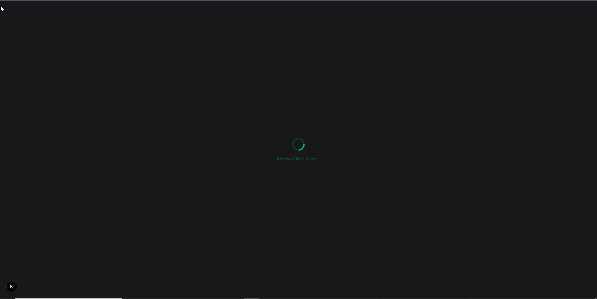

# 🔄 HANDOFF — Progress Tracker

> **TUJUAN FILE INI:**
> File ini adalah "memori" antar sesi chat AI.
> AI WAJIB membaca file ini di awal, dan meng-UPDATE file ini sebelum sesi berakhir.

---

## Status Saat Ini

| Field | Value |
|-------|---------|
| **Issue Terakhir Selesai** | Debt #2: BMN Reports Excel Endpoints (GH #204, PR #205) |
| **Issue Selanjutnya** | Debt #3: API Resource Classes |
| **Branch Aktif** | `main` (clean) |
| **Model Terakhir** | Claude Sonnet / Gemini 2.5 Flash |
| **Timestamp** | 2026-05-09T03:30:00+08:00 |
| **GitHub Issue** | #204 (PR #205 merged) |

---
## ⚠️ STATUS TERKINI (Phase 8 CMS Module)

### ✅ SELESAI (18/18 issues Phase 8):
**#091 - Backend CMS Migrations** (16 tabel CMS dalam 4 migration files)
- GitHub: Issue #91, PR #168 merged ✅

**#092 - Backend CMS Models** (17 Eloquent models untuk 16 tabel CMS)
- 17 models: Category, Website, Kepala, Menu, Informasi, Profil, Kawasan, Tsl, Photo, Video, Pesan, Link, Jenis, Buku, Leaflet(STI), Poster(STI), Regulasi
- Pola: Standar, Relasional(belongsTo/hasMany), Rekursif(Menu), STI(Leaflet/Poster)
- GitHub: Issue #92, PR #169 merged ✅

### 🔧 BUGFIX AUDIT (dilakukan sebelum #093):
**Masalah ditemukan oleh audit Phase 1-8:**
1. ✅ FIXED: `EkternalController.php` — duplikat dead code di luar class body (parse error line 126)
2. ✅ FIXED: Duplikat controller file — hapus `EkternalController.php` (lama), keep `EksternalController.php` (baru)
3. ✅ FIXED: `EksternalController.php` import `Eksternal` model padahal class sebenarnya `Ekternal` → fixed to `Ekternal`
4. ✅ FIXED: `Routes/api.php` import `EkternalController` padahal class aktif adalah `EksternalController` → fixed
5. ✅ FIXED: `EksternalController.php` missing `destroy()` method padahal routes memanggil-nya → added
6. ✅ All PHP files: 0 syntax errors (full scan)
7. ✅ Frontend ESLint: 0 errors

### ⚠️ CATATAN PENAMAAN (Ekternal vs Eksternal):
- **Database table**: `dr_ekternals` (tanpa 's')
- **Model class**: `Ekternal` (file: `Models/Ekternal.php`) — matches DB
- **Controller class**: `EksternalController` (file: `Controllers/EksternalController.php`) — berbeda!
- **FormRequest**: `StoreEksternalRequest` — dengan 's'
- **Routes**: menggunakan `EksternalController` dan `/eksternals` prefix
- **DECISION**: Biarkan seperti ini untuk sekarang. Inkonsistensi minor yang tidak menyebabkan error karena `$table` sudah eksplisit

**#093 - Backend CMS Service Provider** (dual-path routing)
- `Providers/CMSServiceProvider.php` — public route + admin route + migration loading
- `Routes/public.php` — endpoint website pengunjung (tanpa auth)
- `Routes/admin.php` — endpoint admin CMS (auth:sanctum + module.access:cms)
- Registered in `bootstrap/providers.php`
- GitHub: Issue #93, PR #170 merged ✅

**#094 - Backend CMS Public Controller** (etalase website untuk rakyat — read-only)
- `Controllers/Public/PublicController.php` — 20+ metode GET untuk 10 entitas konten
- Entitas: Website, Kepala, Menu, Informasi, Profil, Kawasan, TSL, Photo, Video, Link, Category, Buku, Leaflet, Poster, Regulasi
- Filter: Semua query pakai `is_published=true` atau `scopePublished()`
- Select: Semua query list pakai `->select([...])` eksplisit (kolom sensitif disembunyikan)
- Views counter: `informasiShow()` memanggil `->increment('views_count')`
- GitHub: Issue #94, PR #172 merged ✅

**#095 - Backend CMS Admin Controllers** (armada controller dengan Trait Injection)
- `Traits/AdminCrudTrait.php` — 136 lines, 5 CRUD methods generik + handleFileUpload (UUID masking)
- 10 Controller Ringan: Profil, Kawasan, Tsl, Photo, Video, Link, Leaflet, Poster, Category, Jenis (masing-masing ~14 baris)
- 5 Controller Khusus: Informasi (+togglePublish, eager load), Buku (+jenis eager load), Regulasi (+tahun filter), Website (singleton pattern), Pesan (custom logic)
- DRY: Trait mengeliminasi ~600 baris kode repetitif
- GitHub: Issue #95, PR #174 merged ✅

**#096 - Backend CMS Routes** (99 endpoint API - dual public/admin routing)
- `Routes/public.php` — 21 endpoint GET (website, kepala, menus, categories, links, informasi, profil, kawasan, tsl, photos, videos, buku, leaflet, poster, regulasi)
- `Routes/admin.php` — 78 endpoint CRUD via apiResource + custom (togglePublish, markAsRead)
- Total: 99 routes confirmed via `php artisan route:list --path=cms`
- Also created: KepalaController & MenuController (missing from #095)
- GitHub: Issue #96, PR #176 merged ✅

**#097 - Frontend CMS Layout & Dashboard** (Sidebar 14 link + Dashboard 8 metrik)
- `frontend/src/app/(dashboard)/cms/layout.tsx` — Sidebar dengan SIDEBAR_SECTIONS (4 groups: Umum, Institusi, Media, Publikasi), warna teal
- `frontend/src/app/(dashboard)/cms/page.tsx` — Dashboard dengan 8 stat cards via React Query parallel fetch (Promise.all)
- GitHub: Issue #177, PR #178 merged ✅

**#098 - Frontend CMS Informasi** (Full CRUD Berita dengan Rich Text Editor)
- `frontend/src/app/(dashboard)/cms/informasi/page.tsx` — Tabel daftar berita dengan toggle publish, search, pagination
- `frontend/src/app/(dashboard)/cms/informasi/create/page.tsx` — Form tulis berita baru dengan ReactQuill (dynamic import ssr:false)
- `frontend/src/app/(dashboard)/cms/informasi/[id]/page.tsx` — Form edit berita dengan pre-filled data
- GitHub: Issue #179, PR #180 merged ✅

**#099 - Frontend CMS Reusable CRUD** (Mesin Cetak Halaman Otomatis)
- `_components/types.ts` — Interface CrudColumn, CrudField, CrudPageConfig
- `_components/CrudPageFactory.tsx` — Komponen factory untuk tabel + pagination + search
- `_components/CrudFormDrawer.tsx` — Drawer form generik dengan dukungan file upload multipart
- 12 halaman CRUD ultra-tipis (15-30 baris per halaman): kawasan, profil, tsl, photos, videos, links, buku, leaflet, poster, regulasi, categories, kepala
- GitHub: Issue #181, PR #182 merged ✅

**#100 - Frontend CMS Special Pages** (Website Settings, Pesan Inbox, Menu Builder)
- `website/page.tsx` — Singleton settings form untuk konfigurasi website
- `pesan/page.tsx` — Inbox dengan filter tabs dan aksi mark read/delete
- `menus/page.tsx` — CRUD menu builder menggunakan CrudPageFactory
- GitHub: Issue #183, PR #184 merged ✅

**#101 - Frontend Public Layout** (Kerangka Website Publik)
- `(website)/_components/PublicNavbar.tsx` — Navbar responsif dengan menu dari API + hamburger mobile
- `(website)/_components/PublicFooter.tsx` — Footer 3 kolom (Tentang, Kontak, Link Terkait)
- `(website)/layout.tsx` — Layout pembungkus dengan SEO metadata
- GitHub: Issue #185, PR #186 merged ✅

**#102 - Frontend Landing Page** (Homepage BKSDA)
- `page.tsx` — Landing page dengan Hero, Berita, Kawasan, TSL, Sambutan Kepala
- GitHub: Issue #187, PR #188 merged ✅

**#103 - Frontend Informasi Pages** (Portal Berita Publik)
- `informasi/page.tsx` — Daftar berita dengan filter kategori tab + pencarian debounced + pagination
- `informasi/[slug]/page.tsx` — Detail berita dengan konten HTML + sidebar berita terkait
- Menggunakan axios (publik, bukan auth api)
- Format tanggal Indonesia
- GitHub: Issue #103, PR #191 merged ✅

**#104 - Frontend Kawasan Pages** (Peta Interaktif Konservasi)
- `kawasan/page.tsx` — Daftar kawasan dengan grid kartu + peta overview Leaflet
- `kawasan/[slug]/page.tsx` — Detail kawasan dengan thumbnail + deskripsi + peta zoom
- `_components/KawasanMap.tsx` — Komponen peta dual-mode (single/multi marker)
- SSR-safe dengan `next/dynamic({ ssr: false })`
- Leaflet icon fix via CDN unpkg
- GitHub: Issue #192, PR #193 merged ✅

**#105 - Frontend TSL Pages** (Ensiklopedia Spesies Dilindungi)
- `tsl/page.tsx` — Daftar spesies dengan tab Satwa/Tumbuhan + pencarian debounced + pagination
- `tsl/[slug]/page.tsx` — Detail spesies dengan foto + nama latin italic + kartu IUCN
- Badge IUCN berwarna: CR (merah), EN (oranye), VU (kuning), NT (biru), LC (hijau)
- GitHub: Issue #194, PR #195 merged ✅

**#106 - Frontend Galeri Pages** (Pameran Foto & Video)
- `galeri/page.tsx` — Tab Foto/Video + Masonry Grid + Lightbox + YouTube Embed
- CSS Masonry \`columns-4\` untuk galeri foto
- Lightbox modal dengan \`e.stopPropagation()\` agar tidak close saat klik gambar
- Fungsi \`extractYoutubeId()\` menangani berbagai format URL YouTube
- GitHub: Issue #196, PR #197 merged ✅

**#107 - Frontend Publikasi Pages** (Perpustakaan Digital)
- `publikasi/page.tsx` — 4 tab (Buku, Leaflet, Poster, Regulasi) + grid kartu + download
- \`PublikasiCard\`: Komponen kartu universal dengan spacer flexbox
- Metadata varian per tipe (penulis/penerbit untuk buku, nomor/tahun untuk regulasi)
- GitHub: Issue #198, PR #199 merged ✅

**#108 - Frontend Hubungi Kami** (Halaman Kontak)
- `hubungi-kami/page.tsx` — Form kirim pesan dengan validasi (nama, email, telepon, subjek, pesan)
- POST ke \`/cms/public/pesan\` API endpoint
- Success state dengan animasi CheckCircle
- Layout 2 kolom: info kontak + placeholder peta di kiri, form di kanan
- GitHub: Issue #200, PR #201 merged ✅

### 📝 SEMUA ISSUE PHASE 8 SELESAI (18/18) ✅

### 📊 FILE SUMMARY PHASE 8:
**Backend CMS Migrations (#091):**
- `backend/app/Modules/CMS/Migrations/2024_01_01_000001_create_cms_foundation_tables.php` (cms_categories, cms_website, cms_kepala, cms_menus)
- `backend/app/Modules/CMS/Migrations/2024_01_01_000002_create_cms_content_tables.php` (cms_informasi, cms_profil, cms_kawasan, cms_tsl)
- `backend/app/Modules/CMS/Migrations/2024_01_01_000003_create_cms_media_tables.php` (cms_photos, cms_videos, cms_pesan, cms_links)
- `backend/app/Modules/CMS/Migrations/2024_01_01_000004_create_cms_publication_tables.php` (cms_jenis, cms_buku, cms_leaflet, cms_regulasi)

### File yang Dibuat/Diubah (Phase 8 - CMS)
```
# BACKEND — Issue #091 (Migrations)
backend/app/Modules/CMS/Migrations/2024_01_01_000001_create_cms_foundation_tables.php  ← [NEW] #091
backend/app/Modules/CMS/Migrations/2024_01_01_000002_create_cms_content_tables.php     ← [NEW] #091
backend/app/Modules/CMS/Migrations/2024_01_01_000003_create_cms_media_tables.php       ← [NEW] #091
backend/app/Modules/CMS/Migrations/2024_01_01_000004_create_cms_publication_tables.php ← [NEW] #091

# BACKEND — Issue #092 (17 Models)
backend/app/Modules/CMS/Models/Category.php       ← [NEW] #092 - belongsTo parent rekursif
backend/app/Modules/CMS/Models/Website.php         ← [NEW] #092 - singleton, tanpa SoftDeletes
backend/app/Modules/CMS/Models/Kepala.php          ← [NEW] #092 - scope active()
backend/app/Modules/CMS/Models/Menu.php            ← [NEW] #092 - self-referencing parent/children
backend/app/Modules/CMS/Models/Informasi.php       ← [NEW] #092 - belongsTo Category, scope active()
backend/app/Modules/CMS/Models/Profil.php          ← [NEW] #092 - cast json
backend/app/Modules/CMS/Models/Kawasan.php         ← [NEW] #092 - float casts lat/lng
backend/app/Modules/CMS/Models/Tsl.php             ← [NEW] #092 - scopes satwa()/tumbuhan()
backend/app/Modules/CMS/Models/Photo.php           ← [NEW] #092
backend/app/Modules/CMS/Models/Video.php           ← [NEW] #092 - youtube_url
backend/app/Modules/CMS/Models/Pesan.php           ← [NEW] #092 - scope unread()
backend/app/Modules/CMS/Models/Link.php            ← [NEW] #092
backend/app/Modules/CMS/Models/Jenis.php           ← [NEW] #092 - hasMany Buku, Regulasi
backend/app/Modules/CMS/Models/Buku.php            ← [NEW] #092 - belongsTo Jenis
backend/app/Modules/CMS/Models/Leaflet.php         ← [NEW] #092 - STI pattern (global scope type=leaflet)
backend/app/Modules/CMS/Models/Poster.php          ← [NEW] #092 - STI pattern (global scope type=poster)
backend/app/Modules/CMS/Models/Regulasi.php        ← [NEW] #092 - belongsTo Jenis

# BACKEND — Issue #093 (Service Provider + Routes)
backend/app/Modules/CMS/Providers/CMSServiceProvider.php  ← [NEW] #093 - dual-path routing
backend/app/Modules/CMS/Routes/public.php                 ← [NEW] #093 - website publik (tanpa auth)
backend/app/Modules/CMS/Routes/admin.php                  ← [NEW] #093 - admin CMS (auth:sanctum + module.access:cms)

# BACKEND — Issue #094 (Public Controller - Read-Only Etalase)
backend/app/Modules/CMS/Controllers/Public/PublicController.php  ← [NEW] #094 - 20+ GET endpoints, 337 lines

# BACKEND — Issue #095 (Admin Controllers - Trait Injection)
backend/app/Modules/CMS/Traits/AdminCrudTrait.php              ← [NEW] #095 - 136 lines, 5 CRUD methods + file upload
backend/app/Modules/CMS/Controllers/Admin/ProfilController.php   ← [NEW] #095 - lightweight CRUD via trait
backend/app/Modules/CMS/Controllers/Admin/KawasanController.php  ← [NEW] #095 - lightweight CRUD via trait
backend/app/Modules/CMS/Controllers/Admin/TslController.php       ← [NEW] #095 - lightweight CRUD via trait
backend/app/Modules/CMS/Controllers/Admin/PhotoController.php   ← [NEW] #095 - lightweight CRUD via trait
backend/app/Modules/CMS/Controllers/Admin/VideoController.php   ← [NEW] #095 - lightweight CRUD via trait
backend/app/Modules/CMS/Controllers/Admin/LinkController.php     ← [NEW] #095 - lightweight CRUD via trait
backend/app/Modules/CMS/Controllers/Admin/LeafletController.php ← [NEW] #095 - lightweight CRUD via trait
backend/app/Modules/CMS/Controllers/Admin/PosterController.php   ← [NEW] #095 - lightweight CRUD via trait
backend/app/Modules/CMS/Controllers/Admin/CategoryController.php ← [NEW] #095 - lightweight CRUD via trait
backend/app/Modules/CMS/Controllers/Admin/JenisController.php     ← [NEW] #095 - lightweight CRUD via trait
backend/app/Modules/CMS/Controllers/Admin/InformasiController.php ← [NEW] #095 - override index/store + togglePublish
backend/app/Modules/CMS/Controllers/Admin/BukuController.php      ← [NEW] #095 - override index with eager load
backend/app/Modules/CMS/Controllers/Admin/RegulasiController.php  ← [NEW] #095 - override index with tahun filter
backend/app/Modules/CMS/Controllers/Admin/WebsiteController.php   ← [NEW] #095 - singleton pattern, no trait
backend/app/Modules/CMS/Controllers/Admin/PesanController.php     ← [NEW] #095 - custom index/markAsRead/destroy

# BACKEND — Issue #096 (CMS Routes - 99 endpoints)
backend/app/Modules/CMS/Routes/public.php                 ← [UPDATED] #096 - 21 GET endpoints (was ping stub)
backend/app/Modules/CMS/Routes/admin.php                  ← [UPDATED] #096 - 78 CRUD endpoints (was ping stub)
backend/app/Modules/CMS/Controllers/Admin/KepalaController.php ← [NEW] #096 - lightweight CRUD via trait
backend/app/Modules/CMS/Controllers/Admin/MenuController.php    ← [NEW] #096 - lightweight CRUD via trait

backend/bootstrap/providers.php                           ← [UPDATED] #093 - tambah CMSServiceProvider

# FRONTEND — Issue #097 (CMS Layout & Dashboard)
frontend/src/app/(dashboard)/cms/layout.tsx         ← [NEW] #097 - Sidebar 14 links, 4 section groups
frontend/src/app/(dashboard)/cms/page.tsx           ← [NEW] #097 - Dashboard 8 stat cards, parallel fetch

# FRONTEND — Issue #098 (CMS Informasi CRUD)
frontend/src/app/(dashboard)/cms/informasi/page.tsx        ← [NEW] #098 - Tabel daftar berita, toggle publish, search
frontend/src/app/(dashboard)/cms/informasi/create/page.tsx ← [NEW] #098 - Form create berita dengan ReactQuill
frontend/src/app/(dashboard)/cms/informasi/[id]/page.tsx   ← [NEW] #098 - Form edit berita dengan pre-filled data

# FRONTEND — Issue #099 (CMS Reusable CRUD Components)
frontend/src/app/(dashboard)/cms/_components/types.ts              ← [NEW] #099 - CrudColumn, CrudField, CrudPageConfig interfaces
frontend/src/app/(dashboard)/cms/_components/CrudPageFactory.tsx   ← [NEW] #099 - Config-driven page factory (table + search + pagination)
frontend/src/app/(dashboard)/cms/_components/CrudFormDrawer.tsx   ← [NEW] #099 - Generic form drawer with file upload support
frontend/src/app/(dashboard)/cms/kawasan/page.tsx                  ← [NEW] #099 - Kawasan CRUD page (25 lines)
frontend/src/app/(dashboard)/cms/profil/page.tsx                   ← [NEW] #099 - Profil CRUD page (21 lines)
frontend/src/app/(dashboard)/cms/tsl/page.tsx                     ← [NEW] #099 - TSL CRUD page (28 lines)
frontend/src/app/(dashboard)/cms/photos/page.tsx                  ← [NEW] #099 - Photos CRUD page (21 lines)
frontend/src/app/(dashboard)/cms/videos/page.tsx                  ← [NEW] #099 - Videos CRUD page (21 lines)
frontend/src/app/(dashboard)/cms/links/page.tsx                   ← [NEW] #099 - Links CRUD page (20 lines)
frontend/src/app/(dashboard)/cms/buku/page.tsx                    ← [NEW] #099 - Buku CRUD page (25 lines)
frontend/src/app/(dashboard)/cms/leaflet/page.tsx                 ← [NEW] #099 - Leaflet CRUD page (20 lines)
frontend/src/app/(dashboard)/cms/poster/page.tsx                  ← [NEW] #099 - Poster CRUD page (20 lines)
frontend/src/app/(dashboard)/cms/regulasi/page.tsx                ← [NEW] #099 - Regulasi CRUD page (23 lines)
frontend/src/app/(dashboard)/cms/categories/page.tsx              ← [NEW] #099 - Categories CRUD page (25 lines)
frontend/src/app/(dashboard)/cms/kepala/page.tsx                  ← [NEW] #099 - Kepala CRUD page (23 lines)

# FRONTEND — Issue #100 (CMS Special Pages)
frontend/src/app/(dashboard)/cms/website/page.tsx              ← [NEW] #100 - Website settings singleton form
frontend/src/app/(dashboard)/cms/pesan/page.tsx               ← [NEW] #100 - Pesan inbox dengan filter tabs
frontend/src/app/(dashboard)/cms/menus/page.tsx               ← [NEW] #100 - Menu builder CRUD

# FRONTEND — Issue #101 (Public Layout)
frontend/src/app/(website)/_components/PublicNavbar.tsx    ← [NEW] #101 - Navbar responsif dengan menu dari API
frontend/src/app/(website)/_components/PublicFooter.tsx    ← [NEW] #101 - Footer 3 kolom dari API
frontend/src/app/(website)/layout.tsx                    ← [NEW] #101 - Layout pembungkus Navbar+Footer

# FRONTEND — Issue #102 (Landing Page)
frontend/src/app/page.tsx                               ← [NEW] #102 - Landing page homepage

# FRONTEND — Issue #103 (Informasi Pages)
frontend/src/app/(website)/informasi/page.tsx            ← [NEW] #103 - Daftar berita dengan filter kategori + pagination
frontend/src/app/(website)/informasi/[slug]/page.tsx     ← [NEW] #103 - Detail berita dengan sidebar related articles

# FRONTEND — Issue #104 (Kawasan Pages)
frontend/src/app/(website)/kawasan/page.tsx              ← [NEW] #104 - Daftar kawasan dengan Leaflet map overview
frontend/src/app/(website)/kawasan/[slug]/page.tsx      ← [NEW] #104 - Detail kawasan dengan peta zoom
frontend/src/app/(website)/kawasan/_components/KawasanMap.tsx ← [NEW] #104 - Komponen peta SSR-safe dual-mode

# FRONTEND — Issue #105 (TSL Pages)
frontend/src/app/(website)/tsl/page.tsx                  ← [NEW] #105 - Daftar spesies dengan tab Satwa/Tumbuhan
frontend/src/app/(website)/tsl/[slug]/page.tsx          ← [NEW] #105 - Detail spesies dengan kartu IUCN

# FRONTEND — Issue #106 (Galeri Pages)
frontend/src/app/(website)/galeri/page.tsx               ← [NEW] #106 - Tab Foto/Video + Masonry + Lightbox + YouTube embed

# FRONTEND — Issue #107 (Publikasi Pages)
frontend/src/app/(website)/publikasi/page.tsx             ← [NEW] #107 - 4 tab publikasi + kartu download universal

# FRONTEND — Issue #108 (Hubungi Kami)
frontend/src/app/(website)/hubungi-kami/page.tsx          ← [NEW] #108 - Halaman kontak dengan form kirim pesan

### Catatan Akhir Phase 8
- **IDE Warnings Fix**: File `informasi/page.tsx` dan `publikasi/page.tsx` sedang dalam proses fixing ESLint warnings (1 error setState-in-effect + 12 img warnings). Run `npm run lint -- --max-warnings=0` untuk verifikasi sebelum push final.
- **All 18 GitHub Issues closed**: #91, #92, #93, #94, #95, #96, #97, #98, #99, #100, #101, #102, #103, #104, #105, #106, #107, #108 ✅

### Endpoint API Tersedia (Backend CMS — saat ini)

**Public Routes (`/api/cms/public/*`) — 21 endpoints:**
- `GET /website`, `/kepala`, `/menus`, `/categories`, `/links`
- `GET /informasi`, `/informasi/terbaru`, `/informasi/{slug}`
- `GET /profil`, `/profil/{slug}`
- `GET /kawasan`, `/kawasan/{slug}`
- `GET /tsl`, `/tsl/{slug}`
- `GET /photos`, `/videos`
- `GET /buku`, `/leaflet`, `/poster`, `/regulasi`

**Admin Routes (`/api/cms/admin/*`) — 78 endpoints:**
- CRUD lengkap untuk: informasi, profil, kawasan, tsl, photos, videos, links, buku, leaflet, poster, regulasi, jenis, kepala, menus, categories
- Custom: `PATCH /informasi/{id}/toggle-publish`, `PATCH /pesan/{id}/read`, `GET|PUT /website`
- Total: **99 routes** (verified via `php artisan route:list --path=cms`)
- Middleware: `auth:sanctum` + `module.access:cms` untuk semua admin routes

### Catatan Penting Phase 8 (CMS)
- **STI (Single Table Inheritance)**: `Leaflet` dan `Poster` berbagi tabel `cms_leaflet`. Dibedakan via kolom `type` dan Global Scope.
- **Dual-Path Routing**: CMS punya 2 file route: `public.php` (tanpa auth, untuk pengunjung website) dan `admin.php` (dengan auth, untuk admin kelola konten).
- **17 Models, 16 Tabel**: Leaflet & Poster berbagi 1 tabel → 17 model untuk 16 tabel.
- **Website Model**: Singleton tanpa SoftDeletes (1 row di tabel, tidak perlu soft-delete).
- **Menu Model**: Punya relasi rekursif `parent()` dan `children()` untuk nested menu.
- **Resources/**: Folder `backend/app/Modules/CMS/Resources/`MASIH KOSONG — API Resource classes belum dibuat (technical debt).
- **Technical Debt Lain**: (1) API Resource classes belum ada, (2) Missing return type hints di beberapa controller, (3) Status magic strings tanpa PHP Enum.

### 🔍 Hasil Audit Phase 1-8 (dilakukan sebelum #093)
> Audit menyeluruh terhadap RULES.md (77 rules) menghasilkan:
> - **74% compliance** (57/77 rules pass)
> - **0 security-critical violations**
> - **10 violations** — mayoritas "aspirational" (belum diimplementasi karena fase masih early)
> - **Top 3 hutang teknis**: (1) Tidak ada API Resource classes, (2) Missing return type hints, (3) Status magic strings tanpa PHP Enum
> - **Bugfix**: 5 bugs di `EkternalController.php` ditemukan dan diperbaiki (duplikat code, wrong import, missing method)

---

## Progress Phase 1: Project Init & Foundation (#001–#008)

- [x] #001 — Project Rules & Coding Standards
- [x] #002 — Init Monorepo Structure
- [x] #003 — Backend Laravel Scaffold
- [x] #004 — Backend Database & Env Config
- [x] #005 — Frontend Next.js Scaffold
- [x] #006 — Frontend Design System
- [x] #007 — Docker Compose PostgreSQL
- [x] #008 — Backend IDE Helper Setup

## Progress Phase 2: IAM & Auth (#009–#021)

- [x] #009 — Backend Users Migration & Model
- [x] #010 — Backend Laravel Sanctum Setup
- [x] #011 — Backend Auth Controller
- [x] #012 — Backend Module Access Middleware
- [x] #013 — Backend Role Middleware
- [x] #014 — Backend AuditLog Middleware
- [x] #015 — Backend Register Middleware
- [x] #016 — Frontend API Client
- [x] #017 — Frontend Login Page
- [x] #018 — Frontend Route Guard
- [x] #019 — Frontend Auth Sync
- [x] #020 — Frontend Query Provider
- [x] #021 — Frontend Theme Toggle
- [x] #021b — **Phase 2 UI Overhaul** (Login Page → Split-screen premium)

## Progress Phase 3: Core Module (Kepegawaian) (#022–#034)

- [x] #022 — Backend Employees Migration (`kpg_employees` table)
- [x] #023 — Backend Employee Model (Modular `App\Modules\Kepegawaian\Models\Employee`)
- [x] #024 — Backend KepegawaianServiceProvider (Modular route registration)
- [x] #025 — Backend Employee CRUD Controller + FormRequest
- [x] #026 — Backend Employee Access Controller (IAM via NIP ↔ Username)
- [x] #027 — Backend Kepegawaian Routes (7 endpoints with layered middleware)
- [x] #028 — Frontend Admin Layout (Sidebar + Topbar + RouteGuard)
- [x] #029 — Frontend ModuleSwitcher Component (Dropdown with IAM filter)
- [x] #030 — Frontend LogoutButton Component (Modal confirmation + API revoke)
- [x] #031 — Frontend Portal Page (Grid cards hub with staggered animation)
- [x] #032 — Frontend Employee List Page (TanStack Query + Debounce + Pagination)
- [x] #033 — Frontend Employee Create Form (Split layout + FormData + Image Preview)
- [x] #034 — SuperAdmin Seeder + Integration Test Protocol
- [x] #034b — **Phase 3 UI Overhaul** (Admin Layout, Portal, & Employee UI → Premium Glassmorphism)

---

## Progress Phase 5: Inventory Module (#046–#059)

- [x] #046 — Backend Inventory Migrations (5 tables: categories, offices, items, inventory_stocks, stock_transactions, GitHub Issue #81, PR #82 merged)
- [x] #047 — Backend Inventory Models (5 Eloquent models with cross-module relations, GitHub Issue #83, PR #84 merged)
- [x] #048 — Backend Inventory Service Provider (InventoryServiceProvider + Routes/api.php ping + providers.php, GitHub Issue #85, PR #86 merged)
- [x] #049 — Backend Inventory Service (InventoryService stockIn/stockOut + DB::transaction + lockForUpdate, GitHub Issue #87, PR #88 merged)
- [x] #050 — Backend Inventory Requests (4 FormRequests: StoreOffice, StoreItem, StockIn, StockOut, GitHub Issue #89, PR #90 merged)
- [x] #051 — Backend Inventory Controllers (4 Controllers: Dashboard, Office, Item, Stock with DI, GitHub Issue #91, PR #92 merged)
- [x] #052 — Backend Inventory Routes (8 endpoints, role-based READ/WRITE split, GitHub Issue #94, PR #95 merged)
- [x] #053 — Frontend Inventory Layout (InventorySidebar + layout.tsx, GitHub Issue #96, PR #97 merged)
- [x] #054 — Frontend Inventory Dashboard (stats cards + krisis stok alert, GitHub Issue #98, PR #99 merged)
- [x] #055 — Frontend Inventory Items (split-panel catalog + data grid, GitHub Issue #100, PR #101 merged)
- [x] #056 — Frontend Inventory Stock In (blue glassmorphism form, GitHub Issue #102, PR #103 merged)
- [x] #057 — Frontend Inventory Stock Out (orange form + cross-module employees, GitHub Issue #104, PR #105 merged)
- [x] #058 — Frontend Inventory Transactions (audit trail + backend patch history(), GitHub Issue #106, PR #107 merged)
- [x] #059 — Frontend Inventory Types (5 TypeScript interfaces, GitHub Issue #108, PR #109 merged)

---

## Progress Phase 7: DeReporting Module (#077–#090)

- [x] #077 — Backend DeReporting Migrations (3 files: 7 master tables + dr_internals + dr_eksternals, GitHub Issue #145, PR #146 merged)
- [x] #078 — Backend DeReporting Models (9 Eloquent models: Tahun, Bidang, Koordinator, Anggaran, Jenis, Kategori, JenisData, Internal, Eksternal, GitHub Issue #147, PR #148 merged)
- [x] #079 — Backend DeReporting Service Provider (DeReportingServiceProvider + Routes/api.php ping + providers.php, GitHub Issue #149, PR #150 merged)
- [x] #080 — Backend DeReporting Master Controller (Dynamic model mapping for 7 tables in 1 controller, GitHub Issue #151, PR #152 merged)
- [x] #081 — Backend DeReporting Internal Controller (InternalController: CRUD + 8-relation eager load + private storage + UUID masking, GitHub Issue #153, PR #154 merged)
- [x] #082 — Backend DeReporting Eksternal Controller (EksternalController: throttle:10,1 + IP forensic + admin review, GitHub Issue #155, PR #156 merged)
- [x] #083 — Backend DeReporting Operator Controller (OperatorController: CRUD operator delegation via User IAM mutation, Migration add dereporting columns to users, GitHub Issue #83, PR #158 merged)
- [x] #084 — Backend DeReporting Routes (Strict RBAC routing: Public Zone, Employee Zone, Admin Zone nested middleware, GitHub Issue #159, PR #160 merged)
- [x] #085 — Backend DeReporting Form Requests (StoreInternalRequest & StoreEksternalRequest + Controller refactoring, GitHub Issue #161, PR #162 merged)
- [x] #086 — Frontend DeReporting Public Form (Public whistleblower form at /lapor with bare axios, GitHub Issue #86, PR #163 merged)
- [x] #087 — Frontend DeReporting Dashboard (Analytics dashboard with Recharts + 4 stat cards, GitHub Issue #87, PR #164 merged)
- [x] #088 — Frontend DeReporting Internal (Cascading 4-tier dropdowns with React Query, GitHub Issue #88, PR #165 merged)
- [x] #089 — Frontend DeReporting Sub Pages (Polymorphic filtered sub-pages with shared reusable table, GitHub Issue #89, PR #166 merged)
- [x] #090 — Frontend DeReporting Types (Comprehensive TypeScript interface contracts for all module entities, GitHub Issue #90, PR #167 merged)

**Status: ✅ Phase 7 SELESAI (100%)**

### File yang Dibuat/Diubah (Phase 7 - DeReporting) #083
```
# BACKEND
backend/database/migrations/0001_01_02_add_dereporting_columns_to_users_table.php  ← [NEW] #083
backend/app/Models/User.php                                                  ← [UPDATED] #083 - tambah fillable & relasi dereportingBidang()
backend/app/Modules/DeReporting/Controllers/OperatorController.php           ← [NEW] #083
backend/app/Modules/DeReporting/Routes/api.php                              ← [UPDATED] #083 - tambah route /operators
```

---

## Progress Phase 6: BMN Module (#060–#076)

- [x] #060 — Backend BMN Migrations (`bmn_assets`+SoftDeletes+unique(kode_barang,nup), `bmn_asset_loans`, `bmn_asset_maintenances`, `bmn_asset_updates`, GitHub Issue #110, PR #111 merged)
- [x] #061 — Backend BMN Models (`Asset.php`+SoftDeletes+HasUuids, `AssetLoan.php`, `AssetMaintenance.php`, `AssetUpdate.php`, relasi cross-module ke `Employee`, GitHub Issue #113, PR #115 merged)
- [x] #062 — Backend BMN Service Provider (`BmnServiceProvider.php` register migrations+routes, `Routes/api.php` ping, `bootstrap/providers.php` ditambah BmnServiceProvider, GitHub Issue #116, PR #117 merged)
- [x] #063 — Backend BMN Asset Service (`AssetService.php`: `storeAsset()`, `updateAsset()+audit trail nilai_perolehan & kondisi`, `disposeAsset()+SoftDelete`, GitHub Issue #119, PR #122 merged)
- [x] #064 — Backend BMN Loan & Maintenance Services (`LoanService.php`: `borrowAsset()+pessimistic lock+cek employee_id null`, `returnAsset()+set null employee_id`; `MaintenanceService.php`: `recordMaintenance()+optional kondisi update`, GitHub Issue #124, PR #126 merged)
- [x] #065 — Backend BMN FormRequests (`StoreAssetRequest.php` unique NUP per kode_barang, `UpdateAssetRequest.php` ignore self, `StoreAssetLoanRequest.php` exists kpg_employees, `StoreAssetMaintenanceRequest.php`, `DisposeAssetRequest.php` min:10, GitHub Issue #114, PR #118 merged)
- [x] #066 — Backend BMN Controllers (`AssetController.php`: index+search+onlyTrashed(status=disposed)+store+show+update+dispose; `LoanController.php`: index+borrow+return; `MaintenanceController.php`: index+record, GitHub Issue #120, PR #121 merged)
- [x] #067 — Backend BMN Routes (11 endpoints via `apiResource assets`+`dispose`+`loans`+`loans/{loan}/return`+`maintenances`+`assets/{asset}/loans`+`assets/{asset}/maintenances`, GitHub Issue #123, PR #125 merged)
- [x] #068 — Frontend BMN Layout (`frontend/src/app/(dashboard)/bmn/layout.tsx` sidebar glassmorphism 6 menu active-state, `frontend/src/hooks/use-debounce.ts` hook baru, GitHub Issue #127, PR #128 merged)
- [x] #069 — Frontend BMN Dashboard (`frontend/src/app/(dashboard)/bmn/page.tsx` 4 KPI cards + Recharts BarChart kondisi fisik, mock data sementara, GitHub Issue #129, PR #130 merged)
- [x] #070 — Frontend BMN Assets Table (`frontend/src/app/(dashboard)/bmn/assets/page.tsx` search debounce+pagination+condition badge animate-pulse Rusak Berat, GitHub Issue #131, PR #140 merged)
- [x] #071 — Frontend BMN Asset Form (`frontend/src/app/(dashboard)/bmn/assets/[id]/page.tsx` 3-tab form (Identitas/Valuasi/Lokasi)+react-hook-form+audit trail field wajib saat edit, GitHub Issue #141, PR #142 merged)
- [x] #072 — Frontend BMN Action Modals (`frontend/src/app/(dashboard)/bmn/components/modals/BorrowAssetModal.tsx` + `MaintenanceModal.tsx` dengan sonner toast+invalidateQueries, GitHub Issue #143, PR #144 merged)
- [x] #073 — Frontend BMN Logs (`frontend/src/app/(dashboard)/bmn/maintenances/page.tsx` + `frontend/src/app/(dashboard)/bmn/loans/page.tsx` tabel riwayat dengan pagination, GitHub Issue #132, PR #133 merged)
- [x] #074 — Frontend BMN Disposal (`frontend/src/app/(dashboard)/bmn/disposal/page.tsx` memanggil `?status=disposed` ke endpoint assets yang memicu `onlyTrashed()` di backend, GitHub Issue #134, PR #135 merged)
- [x] #075 — Frontend BMN Reports (`frontend/src/app/(dashboard)/bmn/reports/page.tsx` 3 tombol download Excel via authenticated blob download `responseType: blob`, GitHub Issue #136, PR #137 merged)
- [x] #076 — Frontend BMN Utils (`frontend/src/lib/constants/bmn.ts` konstanta CONDITIONS+LOCATIONS+type AssetState, `frontend/src/lib/bmn-utils.ts` fungsi `formatRupiah()`+`getAssetConditionStyle()`, GitHub Issue #138, PR #139 merged)

### File yang Dibuat/Diubah (Phase 6 - BMN)
```
# BACKEND
backend/app/Modules/Bmn/Migrations/2024_01_01_000001_create_bmn_assets_table.php         ← [NEW] #060
backend/app/Modules/Bmn/Migrations/2024_01_01_000002_create_bmn_asset_loans_table.php    ← [NEW] #060
backend/app/Modules/Bmn/Migrations/2024_01_01_000003_create_bmn_asset_maintenances_table.php ← [NEW] #060
backend/app/Modules/Bmn/Migrations/2024_01_01_000004_create_bmn_asset_updates_table.php  ← [NEW] #060
backend/app/Modules/Bmn/Models/Asset.php                                                  ← [NEW] #061
backend/app/Modules/Bmn/Models/AssetLoan.php                                              ← [NEW] #061
backend/app/Modules/Bmn/Models/AssetMaintenance.php                                       ← [NEW] #061
backend/app/Modules/Bmn/Models/AssetUpdate.php                                            ← [NEW] #061
backend/app/Modules/Bmn/BmnServiceProvider.php                                            ← [NEW] #062
backend/app/Modules/Bmn/Routes/api.php                                                    ← [NEW] #062, [UPDATED] #067
backend/bootstrap/providers.php                                                           ← [UPDATED] #062 - tambah BmnServiceProvider
backend/app/Modules/Bmn/Services/AssetService.php                                         ← [NEW] #063
backend/app/Modules/Bmn/Services/LoanService.php                                          ← [NEW] #064
backend/app/Modules/Bmn/Services/MaintenanceService.php                                   ← [NEW] #064
backend/app/Modules/Bmn/Requests/StoreAssetRequest.php                                    ← [NEW] #065
backend/app/Modules/Bmn/Requests/UpdateAssetRequest.php                                   ← [NEW] #065
backend/app/Modules/Bmn/Requests/StoreAssetLoanRequest.php                                ← [NEW] #065
backend/app/Modules/Bmn/Requests/StoreAssetMaintenanceRequest.php                         ← [NEW] #065
backend/app/Modules/Bmn/Requests/DisposeAssetRequest.php                                  ← [NEW] #065
backend/app/Modules/Bmn/Controllers/AssetController.php                                   ← [NEW] #066
backend/app/Modules/Bmn/Controllers/LoanController.php                                    ← [NEW] #066
backend/app/Modules/Bmn/Controllers/MaintenanceController.php                             ← [NEW] #066

# FRONTEND
frontend/src/hooks/use-debounce.ts                                                        ← [NEW] #068
frontend/src/app/(dashboard)/bmn/layout.tsx                                               ← [NEW] #068
frontend/src/app/(dashboard)/bmn/page.tsx                                                 ← [NEW] #069 - Dashboard
frontend/src/app/(dashboard)/bmn/assets/page.tsx                                          ← [NEW] #070 - Catalog table
frontend/src/app/(dashboard)/bmn/assets/[id]/page.tsx                                     ← [NEW] #071 - Form create/edit
frontend/src/app/(dashboard)/bmn/components/modals/BorrowAssetModal.tsx                   ← [NEW] #072
frontend/src/app/(dashboard)/bmn/components/modals/MaintenanceModal.tsx                   ← [NEW] #072
frontend/src/app/(dashboard)/bmn/maintenances/page.tsx                                    ← [NEW] #073
frontend/src/app/(dashboard)/bmn/loans/page.tsx                                           ← [NEW] #073
frontend/src/app/(dashboard)/bmn/disposal/page.tsx                                        ← [NEW] #074
frontend/src/app/(dashboard)/bmn/reports/page.tsx                                         ← [NEW] #075
frontend/src/lib/constants/bmn.ts                                                         ← [NEW] #076
frontend/src/lib/bmn-utils.ts                                                             ← [NEW] #076
```

### Endpoint API Tersedia (Backend BMN)

| Method | Endpoint | Middleware | Keterangan |
|--------|----------|-----------|------------|
| GET | `/api/bmn/ping` | `auth:sanctum`, `module.access:bmn` | Health check modul |
| GET | `/api/bmn/assets` | same | List aset (search + ?status=disposed untuk trashed) |
| POST | `/api/bmn/assets` | same | Registrasi aset baru |
| GET | `/api/bmn/assets/{asset}` | same | Detail 1 aset dengan relasi |
| PUT | `/api/bmn/assets/{asset}` | same | Update aset + auto audit trail |
| DELETE | `/api/bmn/assets/{asset}/dispose` | same | Soft-delete aset (pemutihan) |
| GET | `/api/bmn/loans` | same | List riwayat peminjaman |
| POST | `/api/bmn/assets/{asset}/loans` | same | Pinjamkan aset ke pegawai |
| POST | `/api/bmn/loans/{loan}/return` | same | Kembalikan aset dari pegawai |
| GET | `/api/bmn/maintenances` | same | List riwayat servis/perbaikan |
| POST | `/api/bmn/assets/{asset}/maintenances` | same | Catat nota servis aset |

### Catatan Penting Phase 6
- **SoftDeletes**: `bmn_assets` menggunakan SoftDeletes — JANGAN gunakan `DELETE` permanen. Disposal via `dispose` endpoint.
- **Audit Trail**: `bmn_asset_updates` otomatis terisi saat `nilai_perolehan` atau `kondisi` berubah via `AssetService::updateAsset()`.
- **Pessimistic Locking**: `LoanService::borrowAsset()` menggunakan `lockForUpdate()` untuk mencegah race condition.
- **Dashboard**: Halaman `/bmn` masih menggunakan mock data. Endpoint `/api/bmn/dashboard/stats` **BELUM DIBUAT** — jika Phase 7 atau seterusnya perlu menghubungkan data real, tambahkan endpoint tersebut di `AssetController` dan `Routes/api.php`.
- **Reports**: Tombol download di `/bmn/reports` memanggil endpoint `/export` yang **BELUM ADA** di backend. Ini adalah UI placeholder — perlu diimplementasi di issue berikutnya jika diperlukan.
- **npm package baru**: `recharts@^3.8.1` ditambahkan di Phase 6.

---

## ⚠️ Hutang Teknis (Technical Debt)

> Catatan item yang **belum dikerjakan** dari Phase 5, Phase 6, dan hasil Audit Phase 1-8.
> Harus diselesaikan sebelum deployment production atau di issue terpisah.

| # | Phase | Deskripsi | Severity | Status |
|---|-------|-----------|----------|--------|
| 1 | Phase 6 (BMN) | **BMN Dashboard** (`/bmn`) masih pakai **mock data**. Endpoint `/api/bmn/dashboard/stats` **BELUM DIBUAT** di backend. | 🟡 MEDIUM | ✅ DONE (GH #202, PR #203) |
| 2 | Phase 6 (BMN) | **BMN Reports** (`/bmn/reports`) — 3 tombol download Excel memanggil endpoint `/export` yang **BELUM ADA** di backend. UI placeholder only. | 🟡 MEDIUM | ✅ DONE (GH #204, PR #205) |
| 3 | ALL (Audit) | **API Resource classes** (`JsonResource`) belum ada di semua module. Semua controller return model langsung (Rule 5.6, 8.10). | 🟡 MEDIUM | ❌ Pending |
| 4 | ALL (Audit) | **Return type hints** missing di semua Controllers kecuali Kepegawaian (Rule 8.12). | 🟢 LOW | ❌ Pending |
| 5 | ALL (Audit) | **PHP Enum** belum dipakai untuk status values — masih magic strings (Rule 8.11). | 🟡 MEDIUM | ❌ Pending |
| 6 | DeReporting | **OperatorController.store()** pakai `Request` bukan `FormRequest` (Rule 8.9). | 🟢 LOW | ❌ Pending |
| 7 | ALL (Audit) | **Laravel Pint** belum pernah dijalankan (Rule 9.9). | 🟢 LOW | ❌ Pending |
| 8 | ALL (Audit) | **Response format** tidak konsisten — beberapa wrapped `{data, message}`, lain raw paginate (Rule 5.1). | 🟢 LOW | ❌ Pending |

---

## Progress Phase 4: Surat Tugas Module (#035–#045c)

- [x] #035 — Backend Assignment Letters Migration (`st_assignment_letters` + `st_assignment_letter_employees`, GitHub Issue #66, PR #67 merged)
- [x] #036 — Assignment Letter Model (`AssignmentLetter.php` + `AssignmentLetterEmployee.php` Pivot, PR #68 merged)
- [x] #037 — SuratTugas Service Provider + API Routing (`SuratTugasServiceProvider.php` + `Routes/api.php` + `bootstrap/providers.php`, PR #69 merged)

- [x] #038 — Assignment Letter Controller + Request (`AssignmentLetterController.php` + `AssignmentLetterRequest.php` + Routes updated, PR #70 merged)
- [x] #039 — API Routing Security Layers (`auth:sanctum`, `module.access:surat_tugas`, `audit.log`, public verify endpoint, PR #71 merged)
- [x] #040 — Public QR Verification Page (`frontend/src/app/(website)/verifikasi/surat-tugas/[id]/page.tsx`, 3-State UI, PR #72 merged)
- [x] #041 — A4 Letter Preview Component (`frontend/src/app/(dashboard)/surat-tugas/_components/AssignmentLetterPreview.tsx`, QR Code + @media print CSS, PR #74 merged)
- [x] #042 — Data Grid + Create Form (`frontend/src/app/(dashboard)/surat-tugas/page.tsx` + `create/page.tsx`, FormData multipart, PR #75 merged)
- [x] #043 — Approval Dialog (`frontend/src/app/(dashboard)/surat-tugas/_components/ApprovalDialog.tsx`, 3-state (approve/reject/input nomor), PR #76 merged)
- [x] #044 — Archive + Filter Status Toolbar (`frontend/src/app/(dashboard)/surat-tugas/page.tsx`, Status dropdown + Trash toggle + Delete/Restore mutations, PR #77 merged)
- [x] #045 — EmployeePicker Component (`frontend/src/components/custom/EmployeePicker.tsx`, debounce 300ms + click-outside, PR #75 merged via #042 dependency)
- [x] #045b — UI Enhancement: Split Panel Create Page (`frontend/src/app/(dashboard)/surat-tugas/create/page.tsx`, split panel left 440px + live A4 preview right, glassmorphism form, gradient submit button)
- [x] #045c — Public Surat Tugas Form + Admin Approve Flow

## File yang Terakhir Dibuat/Diubah (Phase 6 - BMN #076)

> File terbaru ada di section **Progress Phase 6** di atas. Section ini hanya untuk quick reference.

```
# File TERBARU (Phase 6)
frontend/src/lib/bmn-utils.ts                                     ← [NEW] #076
frontend/src/lib/constants/bmn.ts                                 ← [NEW] #076
frontend/src/app/(dashboard)/bmn/reports/page.tsx                 ← [NEW] #075
frontend/src/app/(dashboard)/bmn/disposal/page.tsx                ← [NEW] #074
frontend/src/app/(dashboard)/bmn/loans/page.tsx                   ← [NEW] #073
frontend/src/app/(dashboard)/bmn/maintenances/page.tsx            ← [NEW] #073
frontend/src/app/(dashboard)/bmn/components/modals/*.tsx          ← [NEW] #072
frontend/src/app/(dashboard)/bmn/assets/[id]/page.tsx             ← [NEW] #071
frontend/src/app/(dashboard)/bmn/assets/page.tsx                  ← [NEW] #070
frontend/src/app/(dashboard)/bmn/page.tsx                         ← [NEW] #069
frontend/src/app/(dashboard)/bmn/layout.tsx                       ← [NEW] #068
frontend/src/hooks/use-debounce.ts                                ← [NEW] #068
backend/app/Modules/Bmn/                                          ← [NEW] #060-#067 (seluruh modul)
backend/bootstrap/providers.php                                   ← [UPDATED] #062 - tambah BmnServiceProvider
```

---

## Endpoint API Tersedia (Semua Modul)

### Backend Kepegawaian (`/api/kepegawaian/*`)

| Method | Endpoint | Middleware | Keterangan |
|--------|----------|-----------|------------|
| GET | `/api/kepegawaian/employees` | `auth:sanctum`, `module.access:kepegawaian` | List/Search Pegawai |
| POST | `/api/kepegawaian/employees` | + `role:super_admin,admin` | Tambah Pegawai |
| GET | `/api/kepegawaian/employees/{id}` | `auth:sanctum`, `module.access:kepegawaian` | Detail Pegawai |
| PUT | `/api/kepegawaian/employees/{id}` | + `role:super_admin,admin` | Update Pegawai |
| DELETE | `/api/kepegawaian/employees/{id}` | + `role:super_admin,admin` | Soft Delete Pegawai |
| GET | `/api/kepegawaian/employees/{id}/access` | + `role:super_admin` | Cek Status IAM |
| PUT | `/api/kepegawaian/employees/{id}/access` | + `role:super_admin` | Atur IAM |
| GET | `/api/kepegawaian/employees/select` | `auth:sanctum` | Dropdown Pegawai (lintas modul) |

### Backend Surat Tugas (`/api/surat-tugas/*`)

| Method | Endpoint | Middleware | Keterangan |
|--------|----------|-----------|------------|
| GET | `/api/surat-tugas` | `auth:sanctum`, `module.access:surat_tugas` | List surat dengan filter status |
| POST | `/api/surat-tugas` | same | Buat surat tugas baru |
| GET | `/api/surat-tugas/{id}` | same | Detail surat tugas |
| PUT | `/api/surat-tugas/{id}/approve` | same + `role:admin,super_admin` | Approve surat |
| PUT | `/api/surat-tugas/{id}/reject` | same + `role:admin,super_admin` | Reject surat |
| DELETE | `/api/surat-tugas/{id}` | same + `role:admin,super_admin` | Soft delete (archive) |
| POST | `/api/surat-tugas/{id}/restore` | same + `role:admin,super_admin` | Restore dari archive |
| GET | `/api/public/surat-tugas/{id}/verify` | PUBLIC (no auth) | QR Code verification |

### Backend Inventory (`/api/inventory/*`)

| Method | Endpoint | Middleware | Keterangan |
|--------|----------|-----------|------------|
| GET | `/api/inventory/ping` | `auth:sanctum`, `module.access:inventory` | Health check |
| GET | `/api/inventory/dashboard/stats` | same | Stats: total_items, mutasi_bulan_ini, krisis_stok |
| GET | `/api/inventory/offices` | same | List kantor |
| POST | `/api/inventory/offices` | same + `role:admin,super_admin` | Tambah kantor |
| GET | `/api/inventory/items` | same | List master barang |
| POST | `/api/inventory/items` | same + `role:admin,super_admin` | Tambah master barang |
| GET | `/api/inventory/transactions` | same | Riwayat mutasi (filter ?type=in/out) |
| POST | `/api/inventory/stock/in` | same + `role:admin,super_admin` | Stok masuk |
| POST | `/api/inventory/stock/out` | same + `role:admin,super_admin` | Distribusi keluar ke pegawai |

### Backend BMN (`/api/bmn/*`)

| Method | Endpoint | Middleware | Keterangan |
|--------|----------|-----------|------------|
| GET | `/api/bmn/assets` | `auth:sanctum`, `module.access:bmn` | List aset (?search, ?status=disposed) |
| POST | `/api/bmn/assets` | same | Registrasi aset baru |
| GET | `/api/bmn/assets/{asset}` | same | Detail aset + relasi |
| PUT | `/api/bmn/assets/{asset}` | same | Update aset + auto audit trail |
| DELETE | `/api/bmn/assets/{asset}/dispose` | same | Soft-delete (pemutihan) |
| GET | `/api/bmn/loans` | same | List riwayat peminjaman |
| POST | `/api/bmn/assets/{asset}/loans` | same | Pinjamkan aset |
| POST | `/api/bmn/loans/{loan}/return` | same | Kembalikan aset |
| GET | `/api/bmn/maintenances` | same | List riwayat servis |
| POST | `/api/bmn/assets/{asset}/maintenances` | same | Catat nota servis |

### Backend DeReporting (`/api/dereporting/*`)
| Method | Endpoint | Middleware | Keterangan |
|--------|----------|-----------|------------|
| GET | `/api/dereporting/ping` | `auth:sanctum`, `module.access:dereporting` | Health check modul |
| GET | `/api/dereporting/operators` | same | List operator laporan |
| POST | `/api/dereporting/operators` | same | Angkat pegawai jadi operator |
| PUT | `/api/dereporting/operators/{id}` | same | Mutasi operator ke bidang lain |
| DELETE | `/api/dereporting/operators/{id}` | same | Cabut jabatan operator (demote) |

---

## Akun Super Admin (Seeder)

| Field | Value |
|-------|-------|
| **NIP** | `198001012005011001` |
| **Username (Login)** | `198001012005011001` |
| **Password** | `Bksda2026!@#` |
| **Role** | `super_admin` |
| **Akses Modul** | `kepegawaian`, `bmn`, `inventory`, `dereporting` |

---

## IDE Check Status (Sebelum Push)

| Check | Status | Keterangan |
|-------|--------|------------|
| TypeScript | ✅ | 0 error (`npx tsc --noEmit` clean) |
| ESLint | ✅ | 0 error, 0 warning (`npm run lint -- --max-warnings=0`) |
| Next.js Build | ✅ | 0 error (`npm run build` clean, semua 21 routes compiled) |
| PHP Intelephense | ✅ | 0 error |
| Tailwind v4 IDE | ✅ | 0 warning — 24 canonical class warnings telah di-fix: `bg-gradient-to-*` → `bg-linear-to-*`, `flex-shrink-0` → `shrink-0`, arbitrary values (`z-[100]`, `w-[85px]`, dll) → canonical Tailwind v4 |

---

## Error / Blocker Terakhir

None. Navigation stability, BFCache "Zombie" state, and authentication sync have been resolved with a Next.js-native restore boundary, auth snapshot store, and active React Query refetch.

---

## ⚠️ INSTRUKSI UNTUK AI BARU

Jika kamu membaca file ini di sesi chat baru, lakukan langkah berikut:

1. Baca `HANDOFF.md` di docs DAN `ONBOARDING.md`  di root project untuk konteks arsitektur lengkap.
2. Lihat tabel "Status Saat Ini" di atas untuk tahu posisi terakhir.
3. Lanjutkan dari issue yang tertulis di "Issue Selanjutnya".
4. Baca spec issue di `docs/issues/XXX-*.md`.
5. Referensi kode yang sudah production: `e:\superapp-inventory\`

---

### 🚨 ATURAN KERAS (WAJIB DIPATUHI)

#### A. Git Workflow — DILARANG SHORTCUT
Setiap issue WAJIB mengikuti flow ini **TANPA PENGECUALIAN**:

```bash
# STEP 0 — Buat GitHub Issue (jika belum ada)
gh issue create --title "feat(module): nama issue" --body "deskripsi" --label "backend" # atau frontend

# STEP 1 — Ambil state terbaru & buat branch
git pull origin main
git checkout -b issue/XXX-nama-issue

# STEP 2 — Kerjakan kode sesuai spec di docs/issues/XXX-*.md

# STEP 3 — CEK IDE WARNINGS (WAJIB, lihat poin B untuk detail lengkap)
cd frontend; npm run lint -- --max-warnings=0   # wajib 0
cd frontend; npx tsc --noEmit                   # wajib 0 error
cd frontend; npm run build                       # wajib clean
# Periksa juga IDE Warning All di VS Code Problems tab untuk Tailwind v4 warnings!
# Ganti bg-gradient-to-* → bg-linear-to-*, flex-shrink-0 → shrink-0, dst.

# STEP 4 — Commit
git add backend/ frontend/   # jangan pakai git add . sembarangan
git commit -m "feat(module): deskripsi (#<nomor_gh_issue>)"

# STEP 5 — Push & PR
git push -u origin issue/XXX-nama-issue
gh pr create --title "feat(module): deskripsi (#XXX)" --body "Closes #<nomor_gh_issue>" --base main

# STEP 6 — Merge & cleanup
gh pr merge <PR_NUMBER> --merge --delete-branch
git checkout main; git pull origin main

# STEP 7 — Update HANDOFF.md lalu push
# Tandai issue sebagai [x] di HANDOFF.md, update Status Saat Ini, lalu:
git add docs/HANDOFF.md; git commit -m "docs: update HANDOFF.md - issue #XXX selesai"; git push origin main
```

> ❌ **DILARANG** mulai mengerjakan issue tanpa `gh issue create` terlebih dahulu!
> ❌ **DILARANG** skip cek IDE warning — Tailwind v4 warnings **harus 0** sebelum commit!
> ❌ **DILARANG** commit langsung ke `main` tanpa PR!
> ❌ **DILARANG** `git add .` — selalu spesifikasi folder (`backend/` atau `frontend/`) untuk menghindari commit file tidak perlu!

#### B. IDE Warning Check — SEBELUM SETIAP PUSH

Jalankan **semua command berikut** dan pastikan hasilnya **0 error / 0 warning**:

```bash
# 1. ESLint — wajib 0 warning
cd frontend; npm run lint -- --max-warnings=0

# 2. TypeScript — wajib 0 error
cd frontend; npx tsc --noEmit

# 3. Next.js Build — wajib clean
cd frontend; npm run build

# 4. PHP syntax check
cd backend; php artisan route:list

# 5. IDE Warning All — wajib 0 warning (cek semua problem di VS Code Problems tab)
# Jalankan command ini di VS Code: Ctrl+Shift+M atau klik Problems tab
# Pastikan tidak ada warning apapun, terutama Tailwind v4 canonical class warnings
```

##### ⚠️ Tailwind v4 Canonical Class Warnings (WAJIB CEK)
Proyek ini memakai **Tailwind CSS v4**. IDE (VS Code) akan menampilkan warning jika kamu memakai class lama. **Sebelum commit**, selalu periksa tab `Problems` di VS Code atau jalankan diagnostics.

Aturan penggantian yang **WAJIB** diikuti:

| ❌ Class Lama (v3) | ✅ Class Baru (v4 Canonical) |
|---|---|
| `bg-gradient-to-br` | `bg-linear-to-br` |
| `bg-gradient-to-r` | `bg-linear-to-r` |
| `bg-gradient-to-l` | `bg-linear-to-l` |
| `bg-gradient-to-t` | `bg-linear-to-t` |
| `bg-gradient-to-b` | `bg-linear-to-b` |
| `flex-shrink-0` | `shrink-0` |
| `flex-shrink` | `shrink` |
| `flex-grow-0` | `grow-0` |
| `flex-grow` | `grow` |
| `overflow-ellipsis` | `text-ellipsis` |
| `z-[100]` | `z-100` |
| `border-b-[4px]` | `border-b-4` |
| `w-[85px]` | `w-21.25` |
| `w-[90px]` | `w-22.5` |
| `h-[90px]` | `h-22.5` |
| `w-[100px]` | `w-25` |
| `w-[120px]` | `w-30` |
| `w-[150px]` | `w-37.5` |
| `w-[250px]` | `w-62.5` |
| `w-[300px]` | `w-75` |
| `max-w-[250px]` | `max-w-62.5` |
| `max-w-[300px]` | `max-w-75` |
| `min-h-[400px]` | `min-h-100` |

> **Aturan umum arbitrary value**: Jika nilai adalah kelipatan 4px (`[Xpx]` di mana X % 4 = 0), selalu gunakan `X/4` sebagai angka canonical. Contoh: `w-[160px]` → `w-40`, `h-[48px]` → `h-12`.

Jika ada warning yang tidak ada di tabel di atas, cari di [Tailwind CSS v4 upgrade guide](https://tailwindcss.com/docs/upgrade-guide) atau tanyakan ke user.

#### C. End-of-Phase Checklist (MANDATORY)
Setiap Phase selesai, **WAJIB** jalankan semua langkah ini **SECARA BERURUTAN**:

```bash
# 1. Cek ESLint
cd frontend; npm run lint -- --max-warnings=0

# 2. Cek TypeScript
cd frontend; npx tsc --noEmit

# 3. Cek Build
cd frontend; npm run build

# 4. Cek IDE Warning All (Tailwind v4)
# Buka VS Code Problems tab (Ctrl+Shift+M) — SEMUA warning HARUS 0 sebelum lanjut!
# Semua warning Tailwind v4 HARUS 0 sebelum lanjut!

# 5. Cek GitHub Issues phase ini sudah semua closed
gh issue list --state open

# 6. Cek semua PR sudah merged
gh pr list --state all --limit 20
```

Setelah semua command clean:
- [ ] **ESLint**: `npm run lint -- --max-warnings=0` → **0 warning**
- [ ] **TypeScript**: `npx tsc --noEmit` → **0 error**
- [ ] **Build**: `npm run build` → **clean, 0 error**
- [ ] **IDE Warning All**: Tab Problems VS Code (Ctrl+Shift+M) → **0 warning** (semua warning, termasuk Tailwind v4)
- [ ] **GitHub Issues**: Semua issue phase ini CLOSED
- [ ] **GitHub PRs**: Semua PR sudah MERGED
- [ ] **Update HANDOFF.md**: Checklist `[x]`, Status Saat Ini, timestamp, issue selanjutnya, file tree yang dibuat, endpoint API baru
- [ ] **Update ONBOARDING.md**: Ubah status Phase dari `📋 Spec` → `✅ Done`
- [ ] **Push dokumentasi**: `git add docs/; git commit -m "docs: Phase X complete"; git push origin main`

> ⚠️ **JIKA ADA SATU SAJA LANGKAH YANG TERLEWAT, PHASE BELUM DIANGGAP SELESAI!**

#### D. Sebelum Sesi Berakhir
**WAJIB** update file `HANDOFF.md` ini dengan status terakhir!

---
**STATUS TERAKHIR (2026-05-07):**
- **Rollback dilakukan**: Seluruh skrip navigasi eksperimental (BFCache watchdog & Hard Navigation) dihapus.
- **Kondisi**: Kembali ke "Phase 3 UI Overhaul" yang stabil secara tampilan.
- **Fokus Selanjutnya**: Mencari solusi navigasi yang lebih "Next.js Native" tanpa merusak performa.

**UPDATE SESI (2026-05-07):**
- Investigasi BFCache Zombie state pada alur `/kepegawaian` -> `/bmn` -> browser Back.
- Fix diterapkan di frontend: auth snapshot memakai `useSyncExternalStore`, dashboard layout kembali membaca user dari cookie server-side, provider React Query melakukan invalidate query aktif saat `pageshow persisted`/`popstate`, dan dropdown module switcher ditutup saat restore.
- Validasi frontend: `npm run lint` dan `npm run build` berhasil.

**UPDATE LANJUTAN (2026-05-07):**
- Route `/bmn` ditambahkan sebagai dashboard placeholder agar perpindahan modul tidak jatuh ke 404 sebelum Phase BMN dikerjakan.
- Root provider sekarang meremount client subtree saat browser Back/Forward restore, sekaligus refetch active React Query dan reset `pointer-events` body.
- Skenario terverifikasi via browser automation: login -> `/kepegawaian` -> module switcher `/bmn` -> browser Back; data pegawai tetap tampil, user tetap `Administrator Pusat BKSDA / super_admin`, dan tombol sidebar `Keluar Sistem` membuka modal konfirmasi.

**SESI FASE 4 - #035 (2026-05-07):**
- Issue GitHub: `#66` (feat-surat-tugas-assignment-letters-database-migrations), PR `#67` merged.
- 2 file migrasi dibuat di `backend/app/Modules/SuratTugas/Migrations/`: tabel induk `st_assignment_letters` dan tabel pivot `st_assignment_letter_employees`.
- Validasi wajib dijalankan: `npm run lint` ✅, `npm run build` ✅, `php -l` kedua migrasi ✅.
- Working tree lokal terdeteksi corrupt (puluhan file Phase 1-3 hilang dari disk tapi tercatat di git HEAD) — penyebab: kemungkinan AI sebelumnya mengerjakan di branch berbeda tanpa merge.
- Perbaikan: `git restore .` berhasil memulihkan semua file Phase 1-3 tanpa mengubah file migrasi Phase 4.
- File `frontend/src/proxy.ts.bak` dihapus dari untracked (sesuai pilihan user di awal sesi).
- HANDOFF.md diupdate dengan progress Phase 4.
- Catatan dev: Pastikan sebelum setiap sesi, cek `git status` untuk memastikan working tree bersih.

**FINAL SESI #064 (2026-05-07):**
- GitHub Issue: `#64 fix(frontend): stabilize dashboard back navigation restore`.
- Branch kerja: `issue/064-dashboard-back-navigation-restore`.
- Tujuan: menyelesaikan bug "BFCache Zombie state" saat user berada di `/kepegawaian`, pindah ke `/bmn`, lalu klik browser Back.
- Gejala awal: data pegawai tidak load setelah Back, Topbar sempat fallback ke `Admin SuperApp / Administrator`, dan tombol sidebar `Keluar Sistem` tidak bisa diklik.
- Root cause yang ditemukan: auth state client tidak punya snapshot stabil saat history restore, React Query tidak refetch active query setelah BFCache/popstate, dropdown/overlay module switcher dapat tersisa di atas UI, dan `/bmn` belum punya route sehingga perpindahan modul jatuh ke 404.
- Fix auth: `frontend/src/lib/auth-store.ts` sekarang menyediakan snapshot token+user dari localStorage/cookie, subscribe ke `auth-change`, `storage`, `pageshow`, dan `popstate`; `frontend/src/hooks/useAuth.ts` memakai `useSyncExternalStore`.
- Fix dashboard restore: `frontend/src/components/providers.tsx` menjadi provider aktif root; saat `pageshow persisted` atau `popstate`, provider reset `document.body.style.pointerEvents`, dispatch `auth-change`, invalidate/refetch active React Query, dan remount subtree via `restoreKey`.
- Fix dashboard layout: `frontend/src/app/(dashboard)/layout.tsx` kembali membaca `bksda_user` dari cookie server-side dan mengirim `serverUser` ke Topbar agar tidak flash fallback saat restore.
- Fix Topbar: `frontend/src/components/layout/topbar.tsx` dikembalikan ke pola Phase 2/3, yaitu `ThemeToggle` + profil user; ikon search/notif/help/settings dan logout dobel di kanan user dihapus. Logout tetap hanya di sidebar.
- Fix module switcher/sidebar: `frontend/src/components/module-switcher.tsx` menutup overlay saat `pageshow`/`popstate`; `frontend/src/components/layout/sidebar.tsx` memakai Next `Link` dan menutup drawer mobile saat klik menu.
- Fix API lokal: `frontend/src/lib/api.ts` default base URL lokal ke `http://127.0.0.1:8000/api`, memakai `authStore.logout()` saat 401 non-login, dan tidak lagi memakai `console.error` yang memicu Next dev overlay untuk network/API failure biasa.
- Fix route BMN: `frontend/src/app/(dashboard)/bmn/page.tsx` ditambahkan sebagai placeholder dashboard supaya `/bmn` bukan 404 sebelum Phase BMN resmi dikerjakan.
- File penting yang ikut tersentuh dari sesi navigasi/auth sebelumnya dan dipertahankan: `frontend/src/app/layout.tsx`, `frontend/src/proxy.ts`, `frontend/src/components/logout-button.tsx`, `frontend/src/components/theme-toggle.tsx`, `frontend/src/app/(dashboard)/kepegawaian/page.tsx`, `frontend/src/app/(dashboard)/page.tsx`, `frontend/next.config.ts`.
- File yang sengaja tidak ikut commit: `frontend/src/proxy.ts.bak` karena hanya backup lokal tidak terpakai.
- Validasi wajib yang sudah dijalankan: `npm run lint` di `frontend` berhasil, `npm run build` di `frontend` berhasil, dan `php -l` untuk semua file `backend/app/Modules/**/*.php` berhasil.
- Validasi browser yang sudah dijalankan: login dengan akun seeder, buka `/kepegawaian`, buka module switcher ke `/bmn`, klik browser Back, data pegawai tetap tampil, user tetap `Administrator Pusat BKSDA / super_admin`, tombol sidebar `Keluar Sistem` membuka modal konfirmasi.
- Jika AI baru melanjutkan setelah percakapan ini ditutup: mulai dari `git checkout main && git pull`, baca `HANDOFF.md` dan `ONBOARDING.md`, pastikan issue #64 dan PR terkait sudah closed/merged, lalu lanjut ke Phase 4 Surat Tugas (`docs/issues/035-*.md` sampai `045-*.md`).
- Catatan lokal dev: frontend memakai `http://localhost:3000`, backend Laravel lokal perlu hidup di `http://127.0.0.1:8000`, dan database lokal `.env` backend mengarah ke PostgreSQL `127.0.0.1:5435`.
